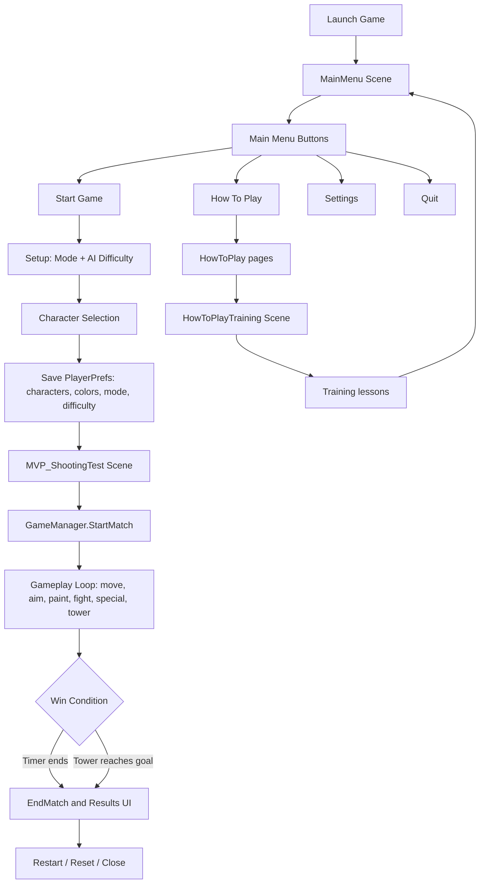
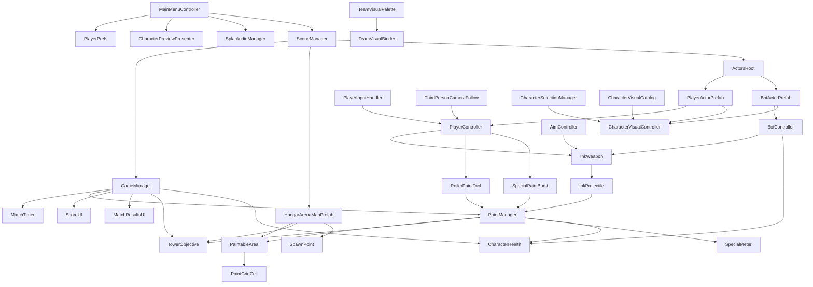
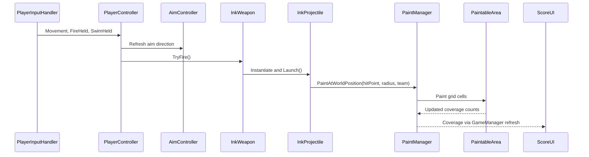

# Splat Fighters - Game Design and Code Documentation / 游戏设计与代码文档

Last updated: 2026-06-08
Project root: `Splat Fighters`
Unity version: `2022.3.62f3c1`

本文档基于当前 Unity 项目目录、脚本、场景、资源、ProjectSettings 和已有 Docs 文件扫描生成，适合课程汇报、项目提交、后续维护与答辩准备使用。
English Summary: This document describes the real implementation of the current Splat Fighters Unity project. Features not found in the repository are explicitly marked as not implemented.

## 1. 项目总览 / Project Overview

| 项目项 / Item | 当前项目内容 / Current Project Content |
| --- | --- |
| 游戏名称 / Game Title | `Splat Fighters` |
| 游戏类型 / Genre | 第三人称彩色墨水竞技射击 / Third-person colorful ink arena shooter |
| 核心玩法 / Core Gameplay | 玩家和 Team B AI 在竞技场内移动、射击、滚刷、覆盖地面、争夺目标并根据模式判定胜负 |
| 目标平台 / Target Platform | Unity 桌面端开发项目；当前项目中暂未发现完整平台发布配置 / Desktop Unity project; full build target setup not found in current implementation |
| 引擎 / Engine | Unity `2022.3.62f3c1`, URP `14.0.12`, UGUI, TextMeshPro, Unity Test Framework |
| 输入系统 / Input System | Unity 旧版 Input Manager 与 `Input.GetAxisRaw` / `Input.GetKey`；当前项目中暂未发现 New Input System 配置 |
| 主要模式 / Modes | Turf War, Tower Control, HowToPlayTraining training scene |
| 可选角色 / Characters | 10 个：Bat, Dragon, Evil Mage, Golem, Monster Plant, Orc, Skeleton, Slime, Spider, Turtle Shell |

中文说明：项目目标是制作一个轻量但完整的本地 PvE 墨水竞技游戏。玩家选择角色和 AI 难度后进入地图，通过覆盖地面、攻击敌人、使用特殊爆发技能和争夺塔目标完成对局。项目目前更像课程 MVP 到 polish 阶段之间的版本：核心循环、角色选择、UI、美术资源、音效、训练关卡和 Tower Control 胜负判断都已经存在。

English Summary: Splat Fighters is a local PvE arena prototype with player movement, ink painting, bot combat, character selection, match UI, project-original procedural audio, a tutorial map, Turf War scoring, Tower Control objective logic, and prefab-authored actor/map structure.

### 项目目录结构概览 / Folder Structure

| 路径 / Path | 作用 / Purpose |
| --- | --- |
| `Assets/Scripts` | 第一方运行时代码 / first-party runtime scripts |
| `Assets/Editor` | 场景、菜单、音频、训练关卡等编辑器自动化脚本 |
| `Assets/Scenes` | `MainMenu`, `MVP_ShootingTest`, `HowToPlayTraining` 三个构建场景 |
| `Assets/Resources` | 运行时加载的角色视觉 prefab、角色 catalog、UI 图片、音频和主菜单 prefab |
| `Assets/Prefabs` | 可复用 gameplay prefabs，包括 actor、map 和 weapon prefabs |
| `Assets/Materials` | 关卡、队伍、训练场材质 |
| `Assets/Hangar Building Modular` | 外部 hangar 环境资源包 |
| `Assets/RPG Monster Wave PBR` | 外部怪物角色资源包 |
| `Assets/Plugins/Zibra` | Zibra Liquid 插件；当前不是核心 gameplay 逻辑 |
| `ProjectSettings` | Unity 项目配置和构建场景配置 |
| `Packages` | Unity package manifest |
| `Docs` | 项目说明、资源引用、音频说明、测试与计划文档 |

## 2. 游戏背景与设计思路 / Game Background and Design Concept

中文说明：当前游戏没有复杂剧情文本，更偏向“怪物斗士参加彩色墨水竞技”的轻剧情设定。角色来自 RPG monster 风格资源包，但 UI 和玩法通过明亮墨水色、喷溅按钮、涂地反馈、hangar 竞技场和角色卡片形成统一的 colorful ink-fighting arena 风格。玩家目标不是单纯消灭敌人，而是在移动和战斗过程中不断改变地图控制权。

English Summary: The game focuses on an energetic paint-splatter arena fantasy. The theme is built through colorful ink colors, monster fighter visuals, graffiti-style menu art, project-original procedural audio, and territory-control gameplay.

设计目标 / Design Goals:

- 让玩家能在几分钟内理解移动、射击、涂地、游泳恢复、特殊技能和目标争夺。
- 通过 10 个怪物角色和角色卡片增强可选身份感。
- 使用清晰的 Team A / Team B 颜色和 HUD，降低测试阶段的信息成本。
- 保持 MVP 稳定，避免大型多人、复杂物理液体或过重 VFX 影响课程演示。

## 3. 完整游戏流程 / Full Game Flow



流程说明：

1. 启动游戏后进入 `Assets/Scenes/MainMenu.unity`。
2. `MainMenuController` 加载 `Resources/UI/MainMenu/Prefabs/MainMenuCanvas`，显示主菜单、设置、教程、开局设置和角色选择界面。
3. 玩家点击 `Start Game` 后进入 setup 流程，选择 `Turf War` 或 `Tower Control`，选择 AI 难度，再进入角色选择。
4. 角色选择界面保存玩家角色、对手角色、双方墨水颜色和 AI 难度到 `PlayerPrefs`。
5. 加载 `Assets/Scenes/MVP_ShootingTest.unity`；场景使用 `HangarArenaMap.prefab` 地图实例和 `Actors` 根下的 `PlayerActor` / `BotActor` 实例，`GameManager.StartMatch()` 清除旧墨水、重置角色出生点、启动计时器和音效。
6. 对局中玩家通过移动、射击、滚刷、游泳、特殊技能改变地图状态；BotController 控制 Team B AI 巡逻、瞄准、涂地和撤退。
7. Turf War 在时间结束时按 Team A / Team B 覆盖率判定；Tower Control 可由塔到达目标点提前结束，否则时间到时按塔进度和控制信息判定。
8. `MatchResultsUI` 显示赢家、模式、覆盖率、Tower 目标总结和重开按钮。
9. How To Play 可以进入 `HowToPlayTraining` 小地图，用任务步骤引导移动、涂地、游泳和 Q 技能。

## 4. 所有功能模块说明 / All Game Features

### 玩家控制系统 / Player Controller

中文说明：`PlayerInputHandler` 读取旧版 Input Manager 的水平/垂直轴，以及 Space、Mouse0、LeftShift；`PlayerController` 将输入转换成第三人称移动、跳跃、游泳和武器开火。

English Summary: Player input is converted into camera-relative movement, jump, swim, route boosts, and weapon firing.

相关脚本 / Related Scripts:

- `Assets/Scripts/Player/PlayerInputHandler.cs`
- `Assets/Scripts/Player/PlayerController.cs`
- `Assets/Scripts/Player/ThirdPersonCameraFollow.cs`
- `Assets/Scripts/Player/AimController.cs`

核心变量 / Key Variables:

- `moveSpeed`, `rotationSpeed`, `jumpHeight`, `gravity`: 角色基础运动参数。
- `playerTeam`: 决定自己墨水、敌方墨水和伤害关系。
- `disableFireWhileSwimming`: 游泳时是否禁止开火。
- `cameraTransform`, `aimController`, `weapon`: 移动、瞄准和攻击协作引用。

主要函数 / Main Methods:

- `PlayerInputHandler.Update()`: 读取方向、跳跃、开火和游泳输入。
- `PlayerController.Update()`: 更新游泳状态、移动、跳跃、重力和开火。
- `GetCameraRelativeMoveDirection()`: 将 WASD 转换为相机相对方向。
- `HandleFireInput()`: 按住 Mouse0 时调用武器或滚刷。
- `ResetMotionState()`: 重生或重开时清空运动状态。

模块关系：玩家控制把输入交给 `InkWeapon`, `RollerPaintTool`, `SpecialPaintBurst`；移动状态和血量信息由 `GameManager` 和 `ScoreUI` 展示。

### 墨水武器与涂地系统 / Ink Weapon and Painting

中文说明：玩家和 AI 使用 `InkWeapon` 发射 `InkProjectile`。Projectile 命中 paintable surface 后调用 `PaintManager.PaintAtWorldPosition()`，最终落到 `PaintableArea` 网格所有权数据中。滚刷由 `RollerPaintTool` 在地面采样多点涂抹。

English Summary: Weapons paint grid cells through PaintManager, and coverage percentages become scoring and objective data.

相关脚本:

- `Assets/Scripts/Weapons/InkWeapon.cs`
- `Assets/Scripts/Weapons/InkProjectile.cs`
- `Assets/Scripts/Weapons/RollerPaintTool.cs`
- `Assets/Scripts/Weapons/PlayerToolSwitcher.cs`
- `Assets/Scripts/Painting/PaintManager.cs`
- `Assets/Scripts/Painting/PaintableArea.cs`
- `Assets/Scripts/Painting/PaintGridCell.cs`
- `Assets/Scripts/Painting/Team.cs`

核心变量:

- `paintRadius`, `projectileSpeed`, `fireCooldown`: 射击节奏和涂地范围。
- `useInkResource`, `currentInk`, `InkPercent`: 墨水资源和 HUD 显示。
- `areaSize`, `GridWidth`, `GridHeight`, `cells`: 涂地网格尺寸与状态。
- `paintableMask`: 哪些格子可计分。

主要函数:

- `InkWeapon.TryFire()`: 检查冷却和墨水后发射。
- `InkProjectile.HandleHit()`: 命中后涂地、播放反馈并销毁。
- `PaintManager.PaintAtWorldPosition()`: 分发给所有注册的 `PaintableArea`。
- `PaintableArea.PaintAtWorldPosition()`: 修改网格格子 owner 并更新队伍计数。
- `RollerPaintTool.PaintCurrentSwath()`: 生成滚刷宽度采样。

模块关系：涂地数据供 `GameManager` 计分、`TowerObjective` 判定塔控制、`SpecialMeter` 充能、`CharacterHealth` 判断敌方墨水伤害。

### 生命、伤害和重生 / Health, Damage, Respawn

中文说明：`CharacterHealth` 按角色所站地面墨水队伍决定是否受到伤害，血量归零触发 elimination。`GameManager` 监听玩家和 Bot 的 `Eliminated` 事件，并在延迟后把角色传送回对应 `SpawnPoint`。

English Summary: Characters can be eliminated by enemy paint and respawned by GameManager after a delay.

相关脚本:

- `Assets/Scripts/Combat/CharacterHealth.cs`
- `Assets/Scripts/Level/SpawnPoint.cs`
- `Assets/Scripts/Managers/GameManager.cs`

核心变量:

- `currentHealth`, `MaxHealth`, `HealthPercent`, `IsEliminated`
- `respawnDelaySeconds`
- `teamASpawn`, `teamBSpawn`

主要函数:

- `ApplyDamage()`, `Eliminate()`, `ReviveFull()`
- `GameManager.HandleCharacterEliminated()`
- `RespawnCharacterAfterDelay()`
- `TeleportCharacter()`

### AI 系统 / Enemy AI System

中文说明：`BotController` 控制 Team B 对手。它支持 Easy、Normal、Hard 难度，能巡逻、选择 paint targets、使用武器、根据地面墨水与血量决定撤退。难度通过 `BotDifficultySettings` 保存到 PlayerPrefs。

English Summary: The Team B bot uses difficulty presets, patrol waypoints, territory-aware aim, firing intervals, and retreat behavior.

相关脚本:

- `Assets/Scripts/AI/BotController.cs`
- `Assets/Scripts/Weapons/InkWeapon.cs`
- `Assets/Scripts/Combat/CharacterHealth.cs`

主要函数:

- `SetDifficulty()`, `ApplyDifficultyPreset()`
- `UpdateTacticalState()`, `UpdateMovement()`, `UpdateAim()`, `UpdateFire()`
- `ResolvePatrolTarget()`, `ResolveRetreatTarget()`

### 游戏管理、计时和胜负 / Match Management

中文说明：`GameManager` 是本地对局核心。它维护 `WaitingToStart`, `Playing`, `Paused`, `Finished` 状态，管理计时、分数刷新、开始、暂停、结束、重置、重生和模式切换。

English Summary: GameManager owns the local match loop and win conditions.

相关脚本:

- `Assets/Scripts/Managers/GameManager.cs`
- `Assets/Scripts/Managers/MatchTimer.cs`
- `Assets/Scripts/Level/TowerObjective.cs`

主要函数:

- `StartMatch()`, `EndMatch()`, `ResetMatch()`, `RestartMatch()`
- `PauseMatch()`, `ResumeMatch()`, `TogglePause()`
- `GetWinningTeam()`, `GetTowerControlWinningTeam()`, `GetPaintCoverageWinningTeam()`
- `TryEndTowerControlByGoal()`

### UI、菜单、设置和教程 / UI, Menu, Settings, Tutorial

中文说明：主菜单由 prefab 和 `MainMenuController` 驱动。游戏内 HUD 由 `ScoreUI` 更新，结束界面由 `MatchResultsUI` 管理。How To Play 包含分页教程和进入训练关卡按钮。Settings 包含音量、图形 preset 和 fullscreen。

English Summary: The UI stack covers menu navigation, setup, character selection, HUD, results, settings, and tutorial pages.

相关脚本:

- `Assets/Scripts/UI/MainMenuController.cs`
- `Assets/Scripts/UI/MainMenuView.cs`
- `Assets/Scripts/UI/ScoreUI.cs`
- `Assets/Scripts/UI/MatchResultsUI.cs`
- `Assets/Scripts/UI/HowToPlayController.cs`
- `Assets/Scripts/UI/TrainingLessonController.cs`
- `Assets/Scripts/UI/AimReticleUI.cs`

### 角色选择与视觉 / Character Selection and Visuals

中文说明：项目有 10 个可选角色视觉 prefab 和 10 张角色卡。Gameplay 场景中的角色根物体现在由 `Assets/Prefabs/Characters/PlayerActor.prefab` 和 `Assets/Prefabs/Characters/BotActor.prefab` 提供，脚本、碰撞体、武器、血量和视觉控制器挂在 actor prefab 上。具体怪物模型由 `CharacterVisualController` 根据 `CharacterVisualCatalog` 实例化到 `CharacterVisualPivot` 下。角色选择界面前方显示 3D 角色模型，后方显示对应角色卡片。选择结果写入 PlayerPrefs，并同步 Team A / Team B 颜色。

English Summary: Character selection combines actor prefabs, runtime visual prefab swapping, 3D previews, card artwork, character-specific ink colors, and PlayerPrefs persistence.

相关脚本:

- `Assets/Scripts/Visuals/CharacterVisualCatalog.cs`
- `Assets/Scripts/Visuals/CharacterSelectionManager.cs`
- `Assets/Scripts/Visuals/CharacterPreviewPresenter.cs`
- `Assets/Scripts/Visuals/CharacterVisualController.cs`
- `Assets/Scripts/Visuals/TeamVisualPalette.cs`
- `Assets/Scripts/Visuals/TeamVisualBinder.cs`

### 音频和反馈 / Audio and Feedback

中文说明：`SplatAudioManager` 是全局音频 singleton，Resources 下包含菜单音乐、玩法音乐和 UI、射击、命中、开局、结束、特殊技能音效。音量通过 PlayerPrefs 保存。

English Summary: Audio is handled by a persistent manager with project-original music, SFX, and volume preferences.

相关资源:

- `Assets/Resources/Audio/Music/MenuLoop.wav`
- `Assets/Resources/Audio/Music/GameplayLoop.wav`
- `Assets/Resources/Audio/SFX/*.wav`
- `Assets/Resources/Audio/Prefabs/SplatAudioManager.prefab`

### 存档或设置系统 / Save and Settings

中文说明：当前项目使用 PlayerPrefs 保存菜单设置、AI 难度、模式、角色选择、角色墨水颜色和音量。当前项目中暂未发现完整存档、关卡进度、排行榜或云存档系统 / Full save data, progression, leaderboard, and cloud save are not found in current implementation.

## 5. 玩法介绍 / Gameplay Introduction

玩家扮演 Team A 的怪物斗士，在一个工业 hangar 风格竞技场中与 Team B AI 对战。玩家使用 WASD 移动、鼠标瞄准、左键发射墨水，也可以切换到滚刷工具快速覆盖地面。站在自己的墨水上按 Left Shift 可以进入游泳状态，用更轻快的方式移动并恢复墨水资源；持续涂地还能积累 special meter，准备好后按 Q 释放范围墨水爆发。

English Summary: The player controls a monster fighter, paints territory, fights an AI opponent, uses ink mobility and special bursts, and wins through mode-specific objectives.

胜利目标取决于模式。Turf War 看倒计时结束时哪一队覆盖更多可计分地面；Tower Control 则要求通过塔附近的墨水占比控制塔，让塔沿路线向敌方目标推进，塔到终点可提前获胜。游戏挑战来自移动、瞄准、资源管理、敌方墨水伤害、AI 压力和目标区域争夺。

## 6. 操作方式说明 / Controls

当前项目使用 Unity 旧版输入 API。New Input System 和完整手柄映射当前项目中暂未发现 / Not found in current implementation.

| 操作 / Action | 按键 / Input | 说明 / Description | 相关脚本 / Script |
| --- | --- | --- | --- |
| Move | WASD / Arrow Keys via `Horizontal` and `Vertical` axes | 控制角色移动 | `PlayerInputHandler` |
| Aim | Mouse | 相机/武器瞄准 | `AimController`, `ThirdPersonCameraFollow` |
| Fire / Paint | Left Mouse Button / `Mouse0` | 发射墨水或滚刷涂地 | `PlayerInputHandler`, `InkWeapon`, `RollerPaintTool` |
| Jump | Space | 跳跃 | `PlayerController` |
| Swim | Left Shift | 在己方墨水上游泳和恢复 | `PlayerController`, `InkWeapon` |
| Shooter Tool | 1 | 切换射击工具 | `PlayerToolSwitcher` |
| Roller Tool | 2 | 切换滚刷工具 | `PlayerToolSwitcher` |
| Special Burst | Q | 释放特殊墨水爆发 | `SpecialPaintBurst` |
| Start Match | Enter | 等待状态开始比赛；菜单主操作 | `GameManager`, `MainMenuController` |
| Restart | R | 重开比赛 | `GameManager` |
| Pause | P / Esc | 暂停或恢复 | `GameManager` |
| Cycle Mode Debug | M | 在运行中切换 Turf War / Tower Control | `GameManager` |
| Menu Back | Esc | 从设置、教程、选择界面返回主菜单 | `MainMenuController` |
| Player Character Select | A / D | 角色选择界面切换玩家角色 | `MainMenuController` |
| Opponent Character Select | Left / Right Arrow | 角色选择界面切换对手角色 | `MainMenuController` |
| Confirm Character | Enter | 保存选择并加载玩法场景 | `MainMenuController` |
| Legacy Runtime Character Switch | C / V | 运行时 `CharacterSelectionManager` 保留的切换键 | `CharacterSelectionManager` |

## 7. 场景搭建说明 / Scene Setup

| Scene Name | Scene Path | Purpose | Main Objects |
| --- | --- | --- | --- |
| MainMenu | `Assets/Scenes/MainMenu.unity` | 主菜单入口 | `MainMenuController`, `EventSystem`, `Main Camera` |
| MVP_ShootingTest | `Assets/Scenes/MVP_ShootingTest.unity` | 核心玩法竞技场 | `GameManager`, `PaintManager`, `Actors`, `HangarArenaMap` prefab instance, `Main Camera` |
| HowToPlayTraining | `Assets/Scenes/HowToPlayTraining.unity` | 新手训练小地图 | `TrainingLessonCanvas`, `TrainingMap`, `Player`, `PaintManager`, `GameManager`, `TrainingTargetDummy` |

### MainMenu Scene

中文说明：场景本身很轻，只放置 controller、camera 和 event system。视觉 UI 由 `MainMenuController` 运行时加载 `Resources/UI/MainMenu/Prefabs/MainMenuCanvas.prefab`，这样主菜单界面更接近 prefab 驱动而不是纯 runtime 拼 UI。

### MVP_ShootingTest Scene

主要对象层级说明 / Scene Hierarchy Explanation:

- `HangarArenaMap`: `Assets/Prefabs/Maps/HangarArenaMap.prefab` 的场景实例，是当前主 gameplay map 的 prefab root。
- `HangarArenaMap/PaintableGround`: 主要可涂地面和计分区域，挂载 `PaintableArea`。
- `HangarArenaMap/SpawnPoints`: `TeamASpawn`, `TeamBSpawn` 和 spawn pad visuals。
- `HangarArenaMap/Objectives`: `CenterTowerObjective`, `CenterTowerRoute`, `CenterTower_TeamAGoal`, `CenterTower_TeamBGoal`, `CenterTower_CenterPoint`。
- `HangarArenaMap/PaintRoutes`: 西侧和东侧 paint route surface，使己方墨水上的路线能提供移动影响。
- `HangarArenaMap/BoundaryWalls`, `Obstacles`, `Cover`, `Platforms`, `HangarAssetVisuals`: 竞技场结构、阻挡、掩体、平台和 hangar visual surfaces。
- `Actors`: gameplay actor root，包含独立于地图 prefab 的角色 prefab instances。
- `Actors/Player`: `Assets/Prefabs/Characters/PlayerActor.prefab` 的场景实例，包含 `CharacterController`, weapon, fire point, visual controller, special meter。
- `Actors/TeamBBot`: `Assets/Prefabs/Characters/BotActor.prefab` 的场景实例，包含 bot controller、weapon、health、fire point。
- `GameManager`, `PaintManager`: 场景层 match 和 paint service，不直接放入地图 prefab。
- `Main Camera`: 第三人称跟随相机。
- `Directional Light`: 主光源。

### HowToPlayTraining Scene

中文说明：训练场景是一个专门的小地图，包含移动区域、涂地练习块、特殊技能目标 pad、训练 dummy、UI lesson panel 和返回主菜单按钮。`TrainingLessonController` 按 Move -> Paint -> Swim -> Special -> Complete 逐步引导。

## 8. 脚本与代码结构总览 / Script and Code Architecture

当前第一方运行时和编辑器脚本：50 个，约 16421 行物理代码。包含第三方 Zibra 插件时：87 个 C# 脚本，约 27853 行。下面表格聚焦第一方脚本；Zibra 插件不是核心 gameplay 代码。

| Script File | Category | Main Responsibility | Important Classes | Notes |
| --- | --- | --- | --- | --- |
| `Assets/Scripts/Managers/GameManager.cs` | Core Management | 对局状态、计时、胜负、暂停、重生 | `GameManager`, `MatchState`, `MatchMode` | 核心 match loop |
| `Assets/Scripts/Managers/MatchTimer.cs` | Core Management | 可配置倒计时模型 | `MatchTimer` | 非 MonoBehaviour 数据类 |
| `Assets/Scripts/Managers/PerformanceProfile.cs` | Settings | 帧率、VSync、fixed delta 配置 | `PerformanceProfile`, `GraphicsPreset` | 菜单图形 preset |
| `Assets/Scripts/AI/BotController.cs` | AI | Team B 巡逻、瞄准、攻击、撤退、难度 | `BotController`, `BotDifficultySettings` | 使用 PlayerPrefs 保存难度 |
| `Assets/Scripts/Audio/SplatAudioManager.cs` | Audio | 音乐/SFX singleton 与音量保存 | `SplatAudioManager` | Resources prefab bootstrap |
| `Assets/Scripts/Combat/CharacterHealth.cs` | Combat | 生命、敌方墨水伤害、淘汰/复活 | `CharacterHealth` | 触发 GameManager respawn |
| `Assets/Scripts/Level/PaintBlocker.cs` | Level | 标记不可涂/不计分区域 | `PaintBlocker` | 用于 PaintableArea mask |
| `Assets/Scripts/Level/PaintRouteSurface.cs` | Level | 己方墨水路线移动影响 | `PaintRouteSurface` | 和 PlayerController 协作 |
| `Assets/Scripts/Level/SpawnPoint.cs` | Level | 队伍出生点、颜色刷新、Gizmos | `SpawnPoint` | GameManager 使用 |
| `Assets/Scripts/Level/TowerObjective.cs` | Objective | Tower Control 控制、路线推进、goal | `TowerObjective` | 基于塔周围涂地占比 |
| `Assets/Scripts/Painting/PaintGridCell.cs` | Painting | 单格 owner 和 paintable 状态 | `PaintGridCell` | PaintableArea 数据 |
| `Assets/Scripts/Painting/PaintManager.cs` | Painting | 管理所有 PaintableArea 和覆盖率查询 | `PaintManager` | Singleton |
| `Assets/Scripts/Painting/PaintableArea.cs` | Painting | 网格涂地、覆盖率、runtime overlay | `PaintableArea` | 核心计分数据结构 |
| `Assets/Scripts/Painting/Team.cs` | Painting | 队伍枚举 | `Team` | `None`, `TeamA`, `TeamB` |
| `Assets/Scripts/Player/AimController.cs` | Player | 鼠标/相机瞄准、reticle、武器方向 | `AimController`, `AimInputMode` | 与 InkWeapon 连接 |
| `Assets/Scripts/Player/PlayerController.cs` | Player | 移动、跳跃、游泳、开火、路线 | `PlayerController`, `RotationMode` | 使用 CharacterController |
| `Assets/Scripts/Player/PlayerInputHandler.cs` | Player | 旧版输入读取 | `PlayerInputHandler` | WASD/Space/Mouse0/Shift |
| `Assets/Scripts/Player/SpecialMeter.cs` | Player | 涂地充能 | `SpecialMeter` | 监听 PaintManager event |
| `Assets/Scripts/Player/SpecialPaintBurst.cs` | Player | Q 键范围涂地技能 | `SpecialPaintBurst` | 需要 meter ready |
| `Assets/Scripts/Player/ThirdPersonCameraFollow.cs` | Player Camera | 第三人称跟随和鼠标 orbit | `ThirdPersonCameraFollow` | 控制视角 |
| `Assets/Scripts/UI/AimReticleUI.cs` | UI | 运行时准星 | `AimReticleUI` | 可自动创建 |
| `Assets/Scripts/UI/HowToPlayController.cs` | UI | 教程 tab 页与训练场加载 | `HowToPlayController` | Main menu tutorial |
| `Assets/Scripts/UI/MainMenuController.cs` | UI | 主菜单、设置、setup、角色选择、场景切换 | `MainMenuController` | Prefab-driven menu flow |
| `Assets/Scripts/UI/MainMenuView.cs` | UI | 主菜单 prefab 引用容器 | `MainMenuView` | Serialized UI bindings |
| `Assets/Scripts/UI/MatchResultsUI.cs` | UI | 结束界面、覆盖率条、重开/重置 | `MatchResultsUI` | 可 runtime 创建 |
| `Assets/Scripts/UI/ScoreUI.cs` | UI | HUD 计时、分数、墨水、血量、塔状态 | `ScoreUI` | 可 runtime 创建 |
| `Assets/Scripts/UI/TrainingLessonController.cs` | UI | 训练关步骤和进度 | `TrainingLessonController` | Training map only |
| `Assets/Scripts/Visuals/CharacterPreviewPresenter.cs` | Visuals | 菜单 3D 角色预览 | `CharacterPreviewPresenter` | 卡片前方模型 |
| `Assets/Scripts/Visuals/CharacterSelectionManager.cs` | Visuals | 运行时角色应用和 PlayerPrefs 保存 | `CharacterSelectionManager` | Gameplay scene bootstrap |
| `Assets/Scripts/Visuals/CharacterVisualCatalog.cs` | Visuals | 角色 catalog、颜色、动画状态 | `CharacterVisualCatalog`, `CharacterVisualOption`, `CharacterInkPalette` | 10 characters |
| `Assets/Scripts/Visuals/CharacterVisualController.cs` | Visuals | 替换模型、缩放适配、动画、游泳形态 | `CharacterVisualController` | 隐藏 prototype mesh |
| `Assets/Scripts/Visuals/InkSplatterVfx.cs` | VFX | 命中墨水粒子 | `InkSplatterVfx` | Procedural VFX |
| `Assets/Scripts/Visuals/LiquidInkProjectileVisual.cs` | VFX | projectile 视觉、trail、材质颜色 | `LiquidInkProjectileVisual` | Lightweight liquid look |
| `Assets/Scripts/Visuals/LiquidInkPuddle.cs` | VFX | 命中 puddle feedback | `LiquidInkPuddle` | Procedural blob |
| `Assets/Scripts/Visuals/TeamVisualBinder.cs` | Visuals | 队伍材质/颜色绑定 | `TeamVisualBinder` | PropertyBlock |
| `Assets/Scripts/Visuals/TeamVisualPalette.cs` | Visuals | 队伍颜色、标签、PlayerPrefs 颜色 | `TeamVisualPalette` | 角色颜色同步 |
| `Assets/Scripts/Weapons/InkProjectile.cs` | Weapons | projectile 飞行、碰撞、涂地、反馈 | `InkProjectile` | Sweep hit detection |
| `Assets/Scripts/Weapons/InkWeapon.cs` | Weapons | 射击、墨水资源、直接准星涂地 | `InkWeapon` | Player/Bot 共用 |
| `Assets/Scripts/Weapons/PlayerToolSwitcher.cs` | Weapons | Shooter/Roller 切换 | `PlayerToolSwitcher`, `ToolMode` | 1/2 keys |
| `Assets/Scripts/Weapons/RollerPaintTool.cs` | Weapons | 滚刷轨迹涂地 | `RollerPaintTool` | Swath samples |
| `Assets/Editor/RpgMonsterCharacterCatalogBuilder.cs` | Editor | 生成角色 catalog | `RpgMonsterCharacterCatalogBuilder` | Editor menu |
| `Assets/Editor/SplatFightersAudioSetup.cs` | Editor | 创建音频 prefab 和菜单音量 UI | `SplatFightersAudioSetup` | Presentation setup |
| `Assets/Editor/SplatFightersActorPrefabSetup.cs` | Editor | 创建 actor prefabs 并把场景角色连接到 prefab instances | `SplatFightersActorPrefabSetup` | Player/Bot prefab architecture |
| `Assets/Editor/SplatFightersGrayboxMapBuilder.cs` | Editor | 生成/修复 MVP 地图、Tower、Bot、Spawn，并更新 map prefab | `SplatFightersGrayboxMapBuilder` | Large scene automation |
| `Assets/Editor/SplatFightersHowToPlaySetup.cs` | Editor | 生成 How To Play 页面 | `SplatFightersHowToPlaySetup` | Menu prefab setup |
| `Assets/Editor/SplatFightersMapPrefabSetup.cs` | Editor | 创建 `HangarArenaMap.prefab` 并重连场景引用 | `SplatFightersMapPrefabSetup` | Map prefab architecture |
| `Assets/Editor/SplatFightersMenuSceneSetup.cs` | Editor | 创建 MainMenu 场景和 prefab references | `SplatFightersMenuSceneSetup` | Scene automation |
| `Assets/Editor/SplatFightersMvpSceneSetup.cs` | Editor | 创建早期 shooting test scene | `SplatFightersMvpSceneSetup` | MVP base setup |
| `Assets/Editor/SplatFightersTrainingSceneSetup.cs` | Editor | 创建训练地图和 lesson UI | `SplatFightersTrainingSceneSetup` | Training scene setup |

## 9. 所有主要代码文件详细说明 / Detailed Code Explanation

### Core Management

#### Script: `Assets/Scripts/Managers/GameManager.cs`

作用：本地对局总控，负责 `MatchState`、`MatchMode`、计时、得分、暂停、重启、重生和胜负判定。类结构包括 `GameManager`, `MatchState`, `MatchMode`。重要字段包括 `matchDurationSeconds`, `matchTimer`, `paintManager`, `scoreUI`, `resultsUI`, `centerTowerObjective`, `teamBBot`, `respawnDelaySeconds`。生命周期方法有 `Awake()`, `Start()`, `Update()`, `OnDestroy()`。

关键逻辑：`StartMatch()` 清理旧状态并启动倒计时；`Update()` 在 Playing 状态 tick 计时器、刷新分数并检查 Tower goal；`EndMatch()` 计算赢家；`GetTowerControlWinningTeam()` 先看 goal，再看路线进度、控制权、塔区域涂地占比。
Potential Issues or Improvements: `CycleMatchMode()` 仍保留调试键 M，正式发布可隐藏；`GameManager` 职责较多，未来可拆成 match state、respawn、objective resolver。

#### Script: `Assets/Scripts/Managers/MatchTimer.cs`

作用：保存倒计时长度、剩余时间和运行状态。主要方法 `Configure()`, `Reset()`, `Start()`, `Stop()`, `Tick()`。
关键逻辑：`Tick(deltaTime)` 减少剩余时间并返回是否结束。
Potential Issues or Improvements: 当前只支持倒计时；若加入 overtime 或 round phases 需要扩展。

#### Script: `Assets/Scripts/Managers/PerformanceProfile.cs`

作用：应用图形 preset，例如 target frame rate、VSync、fixed delta time，并通过 PlayerPrefs 读取菜单设置。主要方法 `Apply()`, `ApplySettings()`, `Restore()`, `LoadPresetFromPreferences()`。
Potential Issues or Improvements: 当前偏全局设置，未来可加质量等级、URP asset preset 或动态分辨率。

### Player, Camera, Special

#### Script: `Assets/Scripts/Player/PlayerInputHandler.cs`

作用：封装旧版输入读取。字段包括 `horizontalAxis`, `verticalAxis`, `jumpKey`, `fireKey`, `swimKey`。`Update()` 设置 movement vector、jump pressed、fire held 和 swim held。
Potential Issues or Improvements: 当前项目中暂未发现完整 rebinding UI / Not found in current implementation.

#### Script: `Assets/Scripts/Player/PlayerController.cs`

作用：角色移动、跳跃、游泳、paint route、开火转发。重要字段包括 `cameraTransform`, `weapon`, `aimController`, `toolSwitcher`, `moveSpeed`, `rotationSpeed`, `playerTeam`, `enablePaintRoutes`, `gravity`。生命周期方法 `Awake()`, `Update()`, `LateUpdate()`。
关键逻辑：读取 `PlayerInputHandler`，计算 camera-relative direction，应用 CharacterController movement；检测脚下地面 Team，决定 own paint / enemy paint / swimming；开火时调用 active weapon 或 roller。
Potential Issues or Improvements: 移动、游泳、路线和开火都在一个 controller 内，未来可拆出 movement ability 和 combat input。

#### Script: `Assets/Scripts/Player/AimController.cs`

作用：根据相机射线和鼠标方向得到瞄准点，旋转角色/武器 pivot，并更新准星 UI。方法包括 `RefreshAimNow()`, `ResolveAimPoint()`, `ResolveAimDirection()`, `UpdateReticle()`。
Potential Issues or Improvements: 需要保证 ignored colliders 和 paintable layers 在所有场景中一致。

#### Script: `Assets/Scripts/Player/ThirdPersonCameraFollow.cs`

作用：第三人称跟随相机，支持鼠标 orbit、锁定 cursor、平滑位置和旋转。方法包括 `LateUpdate()`, `UpdateOrbitInput()`, `SnapToTarget()`。
Potential Issues or Improvements: 当前项目中暂未发现完整 camera collision avoidance / Not found in current implementation.

#### Script: `Assets/Scripts/Player/SpecialMeter.cs`

作用：根据涂地事件为某队积累 special charge。方法包括 `OnEnable()`, `OnDisable()`, `HandlePaintApplied()`, `ConsumeReadyCharge()`。
关键逻辑：监听 PaintManager paint event，达到阈值后 `IsReady` 为 true。
Potential Issues or Improvements: 未来可根据技能类型、角色或命中敌人提供不同充能规则。

#### Script: `Assets/Scripts/Player/SpecialPaintBurst.cs`

作用：按 Q 消耗 special meter，在瞄准点或角色附近释放范围涂地，并生成反馈。方法包括 `Update()`, `TryActivate()`, `ResolvePaintPoint()`, `SpawnFeedback()`。
Potential Issues or Improvements: 当前只发现一种特殊技能；多角色技能系统暂未发现。

### Painting and Weapons

#### Script: `Assets/Scripts/Painting/Team.cs`

作用：定义队伍枚举，核心取值为 `None`, `TeamA`, `TeamB`。
Potential Issues or Improvements: 若加入多人队伍，可从 enum 扩展为 team data asset。

#### Script: `Assets/Scripts/Painting/PaintGridCell.cs`

作用：保存一个网格单元是否可涂、当前 owner 和是否已涂。主要方法 `SetOwner()`, `SetPaintable()`, `Clear()`。
Potential Issues or Improvements: 当前为对象 cell，未来性能优化可改成数组结构。

#### Script: `Assets/Scripts/Painting/PaintManager.cs`

作用：Singleton 管理场景中的 `PaintableArea`，提供涂地、覆盖率、team 查询、nearest cell 和清除接口。重要方法 `PaintAtWorldPosition()`, `GetCoveragePercent()`, `GetTeamCellCountsInWorldBounds()`, `ClearAllPaint()`。
Potential Issues or Improvements: Singleton 便于 MVP，但多场景 additive 或 multiplayer 需要明确上下文。

#### Script: `Assets/Scripts/Painting/PaintableArea.cs`

作用：核心涂地网格。字段包括 `areaSize`, `GridWidth`, `GridHeight`, overlay colors, `useLiquidRuntimeOverlay` 等。生命周期方法 `Awake()`, `Start()`, `LateUpdate()`, `OnValidate()`, `OnDestroy()`。
关键逻辑：把世界坐标转换为格子，按半径设置 owner，维护 Team A / Team B cell counts，支持 blockers 重建 paintable mask，并在运行时绘制 overlay。
Potential Issues or Improvements: 大地图或高分辨率网格可能需要对象池、mesh batching 或 texture-based paint。

#### Script: `Assets/Scripts/Weapons/InkWeapon.cs`

作用：通用射击武器，Player 和 Bot 共用。字段包括 projectile prefab、fire point、team、speed、paint radius、cooldown、ink resource、aim settings。方法包括 `TryFire()`, `RecoverInk()`, `ResetInkResource()`, `PaintDirectlyAtAimTargetIfNeeded()`。
关键逻辑：检查 match state、冷却、墨水资源，然后生成 projectile 或直接按准星点涂地；站在己方墨水上可恢复。
Potential Issues or Improvements: projectile pooling 当前项目中暂未发现 / Not found in current implementation.

#### Script: `Assets/Scripts/Weapons/InkProjectile.cs`

作用：处理 projectile launch、碰撞、trigger、sweep hit、涂地点解析和 impact feedback。方法包括 `Launch()`, `FixedUpdate()`, `OnCollisionEnter()`, `OnTriggerEnter()`, `HandleHit()`。
Potential Issues or Improvements: 高频射击下 Instantiate/Destroy 可能有性能压力，建议后续加 object pooling。

#### Script: `Assets/Scripts/Weapons/PlayerToolSwitcher.cs`

作用：在 Shooter 和 Roller 之间切换。字段包括 `defaultTool`, `currentTool`, `shooter`, `roller`, `shooterKey`, `rollerKey`。方法 `SetTool()`, `ApplyToolState()`。
Potential Issues or Improvements: 当前只有两种工具，未来可扩成 tool loadout 数据。

#### Script: `Assets/Scripts/Weapons/RollerPaintTool.cs`

作用：滚刷按宽度和采样点涂地。字段包括 `paintKey`, `requireMatchPlaying`, `PaintRadius`, `HalfWidth`, `SwathSamples`。方法 `PaintCurrentSwath()`, `ResolvePaintPoint()`。
Potential Issues or Improvements: 滚刷视觉和碰撞范围可继续和实际 paint swath 对齐。

### Combat, Level, Objective, AI

#### Script: `Assets/Scripts/Combat/CharacterHealth.cs`

作用：角色血量、伤害、淘汰、复活。关键方法 `ApplyDamage()`, `Eliminate()`, `ReviveFull()`, `TryGetEnemyPaintTeam()`。
关键逻辑：如果角色站在敌方墨水上且 match playing，则持续受伤；淘汰后隐藏/禁用相关角色组件。
Potential Issues or Improvements: 当前没有复杂 hitbox 或直接 projectile damage 系统；主要伤害来自敌方地面墨水。

#### Script: `Assets/Scripts/Level/SpawnPoint.cs`

作用：保存 Team spawn 位置和方向，刷新 spawn pad 颜色并绘制 gizmos。方法 `Configure()`, `RefreshSpawnPadColor()`, `OnDrawGizmos()`。
Potential Issues or Improvements: 若加入多人，需要多个 spawn 权重和占用检测。

#### Script: `Assets/Scripts/Level/PaintBlocker.cs`

作用：为 PaintableArea 提供世界 bounds，标记哪些区域不可涂或不计分。方法 `TryGetWorldBounds()`, `Configure()`。
Potential Issues or Improvements: blocker 与视觉模型同步依赖场景搭建准确性。

#### Script: `Assets/Scripts/Level/PaintRouteSurface.cs`

作用：检测指定队伍是否拥有 probe 点附近墨水，并提供 route velocity。方法 `IsActiveForTeam()`, `GetRouteVelocity()`。
Potential Issues or Improvements: 目前是局部路线机制，后续可做成更明确的 speed lane 或 conveyor 规则。

#### Script: `Assets/Scripts/Level/TowerObjective.cs`

作用：Tower Control 目标。字段包括 `teamBGoal`, `centerPoint`, `teamAGoal`, `routeProgress`, `moveSpeed`, `controlThresholdPercent`, `minimumPaintedPercent`。方法包括 `RefreshControlState()`, `UpdateRouteProgress()`, `ResetObjective()`, `GetControlBounds()`。
关键逻辑：塔周围 bounds 内 Team A / Team B paint percent 超过阈值时获得控制；控制队伍推动 `routeProgress`；到达 `GoalTeam` 时 GameManager 可提前结束。
Potential Issues or Improvements: 当前目标主要由塔周围涂地控制，没有检测角色站在塔上。

#### Script: `Assets/Scripts/AI/BotController.cs`

作用：Team B AI。类结构包括 `BotDifficulty`, `BotDifficultySettings`, `BotController`。字段覆盖 movement、turn speed、waypoints、paint targets、fire interval、aim error、retreat settings。方法 `UpdateTacticalState()`, `UpdateMovement()`, `UpdateAim()`, `UpdateFire()`。
Potential Issues or Improvements: AI 当前是规则型，不是寻路系统；复杂地图可考虑 NavMesh 或 utility AI。

### UI and Audio

#### Script: `Assets/Scripts/UI/MainMenuController.cs`

作用：主菜单、setup、settings、instructions、角色选择、场景加载。字段包括 menu groups、buttons、volume sliders、character previews、card sprites、selected mode/difficulty/characters。生命周期方法 `Awake()`, `Start()`, `Update()`, `OnDestroy()`。
关键逻辑：`HandlePrimaryAction()` 开始 setup；`CycleMenuMatchMode()` 保存模式；`HandleDifficultyAction()` 保存 AI 难度；`ShowCharacterSelection()` 显示选择界面；`ConfirmCharacterSelection()` 保存角色、颜色并加载 `MVP_ShootingTest`。
Potential Issues or Improvements: 脚本很大，未来可拆 `MenuNavigation`, `SettingsPanel`, `CharacterSelectPanel`。

#### Script: `Assets/Scripts/UI/MainMenuView.cs`

作用：主菜单 prefab 的 serialized reference holder。它不包含复杂方法，只暴露 Canvas、panel、buttons、sliders、character card images 和 sprites。
Potential Issues or Improvements: 对 prefab 字段依赖较多，需要在 prefab 修改后做 reference validation。

#### Script: `Assets/Scripts/UI/ScoreUI.cs`

作用：HUD。显示时间、Team A/B 覆盖率、墨水、血量、special、当前工具、match status、Tower objective。方法包括 `UpdateView()`, `CreateRuntimeScoreUI()`, `FormatObjectiveLine()`。
Potential Issues or Improvements: 当前可 runtime 创建；正式 UI polish 可更多依赖 prefab，减少 runtime UI 生成。

#### Script: `Assets/Scripts/UI/MatchResultsUI.cs`

作用：结束界面，显示赢家、模式、覆盖率条、Tower 总结和按钮。方法 `Bind()`, `HandleMatchStateChanged()`, `RefreshResults()`, `HandleRestartClicked()`。
Potential Issues or Improvements: 若加入统计数据，可扩展 paints fired、damage taken、special used。

#### Script: `Assets/Scripts/UI/HowToPlayController.cs`

作用：How To Play 页面 tab 切换和训练场按钮。方法 `ShowPage()`, `RegisterTabHandlers()`, `StartTrainingScene()`。
Potential Issues or Improvements: 当前教程内容已分页，但可继续加入图片示例或短 GIF；当前项目中暂未发现内嵌视频教程。

#### Script: `Assets/Scripts/UI/TrainingLessonController.cs`

作用：训练小地图里的步骤控制。LessonStep 包括 `Move`, `Paint`, `Swim`, `Special`, `Complete`。方法 `UpdateLessonState()`, `GetProgress()`, `ReturnToMainMenu()`。
Potential Issues or Improvements: 当前训练目标固定，未来可支持 replay、skip、评分或 ghost guidance。

#### Script: `Assets/Scripts/UI/AimReticleUI.cs`

作用：生成并更新准星 UI。方法 `CreateRuntimeReticle()`, `SetState()`, `ApplyColor()`, `SetAnchoredPosition()`。
Potential Issues or Improvements: 当前偏 runtime UI，正式美术可改 prefab。

#### Script: `Assets/Scripts/Audio/SplatAudioManager.cs`

作用：全局音频管理。字段包括 menu/gameplay music、UI click/confirm/back、selection、weapon fire、ink impact、match start/end、special burst clips，以及 master/music/sfx volume。方法包括 `Bootstrap()`, `Awake()`, `Play...Sound()`, `Set...Volume()`, `ApplyVolumes()`。
Potential Issues or Improvements: 当前音频已集中管理；未来可加 mixer snapshot、ducking 和 spatial SFX。

### Visuals

#### Script: `Assets/Scripts/Visuals/CharacterVisualCatalog.cs`

作用：保存角色选项、角色 prefab、墨水颜色和动画状态。包含 `CharacterInkPalette` 和 `CharacterVisualOption`。
关键内容：10 个 fallback 角色和颜色：Bat purple, Dragon red, Evil Mage pink, Golem teal, Monster Plant green, Orc orange, Skeleton cyan, Slime lime, Spider yellow, Turtle Shell blue。
Potential Issues or Improvements: 当前角色数据写在代码 fallback 和 asset 中，未来可更彻底使用 ScriptableObject 编辑。

#### Script: `Assets/Scripts/Visuals/CharacterSelectionManager.cs`

作用：在场景加载后应用玩家和对手角色选择，并保存 PlayerPrefs。方法 `BootstrapActiveScene()`, `SelectCharacter()`, `AttachVisualController()`, `SaveSelectedCharactersAndColors()`。
Potential Issues or Improvements: 保留 C/V legacy runtime switch，最终版可视情况隐藏。

#### Script: `Assets/Scripts/Visuals/CharacterPreviewPresenter.cs`

作用：菜单选择界面里的 3D 角色预览。方法 `Configure()`, `Select()`, `FitPreviewToStage()`, `ApplyCharacterTint()`。
Potential Issues or Improvements: 角色卡和 3D 模型位置需要随 UI 美化持续调试避免遮挡。

#### Script: `Assets/Scripts/Visuals/CharacterVisualController.cs`

作用：运行时替换角色模型、适配 CharacterController、应用颜色、处理游泳形态和动画。方法 `Select()`, `SetSwimming()`, `FitToCharacterController()`, `UpdateAnimation()`, `HandleWeaponFired()`。
Potential Issues or Improvements: 依赖动画状态名字符串，未来可用 Animator parameter 或 data validation 降低出错风险。

#### Script: `Assets/Scripts/Visuals/TeamVisualPalette.cs`

作用：提供 Team A / Team B label、颜色读取和 PlayerPrefs 保存。方法 `GetColor()`, `SaveSelectedColor()`, `EnableRuntimeSelectedColors()`。
Potential Issues or Improvements: 若未来有更多队伍，需要重构硬编码 Team A/B。

#### Script: `Assets/Scripts/Visuals/TeamVisualBinder.cs`

作用：把材质或 property block 应用于队伍对象。方法 `ApplyVisuals()`, `RefreshRenderers()`, `Configure()`。
Potential Issues or Improvements: prefab 改动时需确认 child renderers 是否正确收集。

#### Script: `Assets/Scripts/Visuals/InkSplatterVfx.cs`

作用：生成墨水命中粒子和 droplets。方法 `Spawn()`, `ConfigureParticles()`, `CreateChildParticleSystem()`。
Potential Issues or Improvements: 已有最大 active instance 限制；未来可继续用 pooling 降 GC。

#### Script: `Assets/Scripts/Visuals/LiquidInkProjectileVisual.cs`

作用：为 projectile 添加核心材质、trail renderer 和颜色脉冲。方法 `Configure()`, `Update()`, `ApplyCoreMaterial()`, `ConfigureTrail()`。
Potential Issues or Improvements: 当前是 lightweight 视觉，不依赖真实液体模拟。

#### Script: `Assets/Scripts/Visuals/LiquidInkPuddle.cs`

作用：在命中点生成短生命周期 puddle blob。方法 `Spawn()`, `Configure()`, `ApplyProperties()`。
Potential Issues or Improvements: 可与 PaintableArea overlay 更紧密结合。

### Editor Automation

#### Script: `Assets/Editor/RpgMonsterCharacterCatalogBuilder.cs`

作用：生成或更新 `Assets/Resources/CharacterVisualCatalog.asset`，把 RPG Monster Wave PBR 角色 prefab、显示名、动画状态和墨水颜色整理成可运行时读取的 catalog。主要方法包括 `EnsureCatalog()`, `CreateOption()`, `EnsureResourcesFolder()`。
Potential Issues or Improvements: 需要在角色资源路径变化时同步更新 `PrefabRoot`。

#### Script: `Assets/Editor/SplatFightersAudioSetup.cs`

作用：创建或更新 `SplatAudioManager.prefab`，绑定生成的音乐/SFX clip，并更新主菜单 settings 里的音量控制行。主要方法包括 `ApplyAudioPresentationSetup()`, `CreateOrUpdateAudioManagerPrefab()`, `UpdateMainMenuAudioControls()`, `CreateVolumeRow()`。
Potential Issues or Improvements: 菜单 prefab 结构变化时，需要重新验证 object references。

#### Script: `Assets/Editor/SplatFightersActorPrefabSetup.cs`

作用：把 gameplay 角色从普通 scene objects 整理成可维护的 actor prefabs。它创建/更新 `Assets/Prefabs/Characters/PlayerActor.prefab` 和 `Assets/Prefabs/Characters/BotActor.prefab`，并把 `MVP_ShootingTest` 中的 `Player`、`TeamBBot` 转换为 prefab instances，统一放在 `Actors` root 下。主要方法包括 `ApplyActorPrefabArchitecture()`, `RebuildActorPrefabs()`, `CreateActorRoot()`, `ConfigurePlayerActor()`, `ConfigureBotActor()`, `ReconnectSceneReferences()`。
Potential Issues or Improvements: 手工修改 actor prefab 后，需要重新确认 camera follow、GameManager player/bot references、training scene references 和 visual pivot 仍然正确。

#### Script: `Assets/Editor/SplatFightersGrayboxMapBuilder.cs`

作用：当前 MVP 竞技场的重要自动化构建器。它创建/修复 boundary walls、platforms、cover、paint routes、tower objective、spawn points、Team B Bot、hangar visuals 和 arena containment colliders，并在最后同步 `HangarArenaMap.prefab` 与 actor prefabs。主要方法包括 `BuildIntoMvpScene()`, `BuildInCurrentScene()`, `BuildTowerObjective()`, `BuildSpawnPoints()`, `BuildTeamBBot()`。
Potential Issues or Improvements: 该脚本很大，后续可拆成 ArenaBuilder、ObjectiveBuilder、BotSetup 和 HangarVisualBuilder；拆分时需要保留 prefab 同步步骤。

#### Script: `Assets/Editor/SplatFightersHowToPlaySetup.cs`

作用：构建主菜单中的 How To Play presentation panel，包括 tabs、pages、info cards、mode cards、key blocks、tips 和 training button。主要方法包括 `ApplyHowToPlayPresentationSetup()`, `CreatePages()`, `CreateBasicsPage()`, `CreateControlsPage()`, `CreateModesPage()`。
Potential Issues or Improvements: 教程内容扩展时，可把页面数据抽成 ScriptableObject 或 JSON。

#### Script: `Assets/Editor/SplatFightersMenuSceneSetup.cs`

作用：创建或修复 `MainMenu` 场景、菜单相机、EventSystem、MainMenuCanvas prefab references，并确保场景路径存在。主要方法包括 `CreateMainMenuScene()`, `CreateMenuCanvas()`, `CreateMenuCamera()`, `AssignMenuReferences()`。
Potential Issues or Improvements: 手工 UI polish 后，应避免自动化脚本误覆盖最终 prefab 布局。

#### Script: `Assets/Editor/SplatFightersMapPrefabSetup.cs`

作用：把主 gameplay 地图整理成 `Assets/Prefabs/Maps/HangarArenaMap.prefab`。它把 `PaintableGround`、`PaintableArea`、`PaintBlocker`、`PaintRouteSurface`、`SpawnPoint`、`TowerObjective`、obstacles、platforms 和 hangar visuals 归入 map prefab root，同时保留 `GameManager`、`PaintManager`、`Actors`、camera 和 lighting 在 scene layer。主要方法包括 `ApplyMapPrefabArchitecture()`, `CreateOrUpdateMapPrefab()`, `CollectMapObjects()`, `ReconnectPaintManager()`, `ReconnectObjectiveAndSpawnReferences()`。
Potential Issues or Improvements: map prefab 不应包含 actor prefabs；如果未来复制地图变体，需要检查 spawn points、tower route 和 paint areas 的 scene references。

#### Script: `Assets/Editor/SplatFightersMvpSceneSetup.cs`

作用：早期 MVP shooting test 的基础场景构建器，生成 projectile prefab、灯光、相机、PaintManager、GameManager、paintable ground、player 和 camera follow 配置。主要方法包括 `CreateMvpShootingTestScene()`, `CreateOrUpdateProjectilePrefab()`, `CreatePlayer()`, `ConfigureCameraFollow()`。
Potential Issues or Improvements: 该脚本仍可作为 baseline regeneration 工具，但当前 MVP 场景已由 graybox builder、actor prefab setup 和 map prefab setup 扩展。

#### Script: `Assets/Editor/SplatFightersTrainingSceneSetup.cs`

作用：创建 `HowToPlayTraining` 小地图，包括训练地面、边界、练习块、目标 dummy、玩家、武器、滚刷、GameManager、lesson canvas 和 Back to Menu button。主要方法包括 `CreateHowToPlayTrainingScene()`, `CreateTrainingMap()`, `CreateGameManager()`, `CreateTrainingLessonCanvas()`。
Potential Issues or Improvements: 训练步骤如果继续增加，建议把目标对象命名和 lesson data 做成可配置数据。

English Summary: Editor scripts make the project reproducible by regenerating scenes, UI, audio setup, maps, spawn points, bots, training content, character catalog assets, prefab-authored actor roots, and the reusable HangarArenaMap prefab.

Potential Issues or Improvements: Editor automation 很有价值，但应持续保持和手工 prefab/scene polish 同步，否则重新生成场景可能覆盖后续人工调整，或让 prefab references 与 scene references 失配。

## 10. 游戏核心循环 / Core Gameplay Loop

```text
Initialize Scene
-> Load HangarArenaMap prefab instance and Actors prefab instances
-> Resolve GameManager, PaintManager, UI, PlayerActor, BotActor, Tower
-> StartMatch clears paint and resets spawn points
-> PlayerInputHandler reads movement/fire/swim input
-> PlayerController moves and forwards combat input
-> InkWeapon / RollerPaintTool paints PaintableArea through PaintManager
-> BotController moves, aims, fires, retreats
-> CharacterHealth checks enemy paint damage and elimination
-> GameManager refreshes score and objective state
-> ScoreUI displays timer, coverage, ink, health, special, tower
-> Win condition is checked
-> MatchResultsUI displays result
-> Restart, reset, close, or return through scene/menu flow
```

## 11. 主要函数和方法索引 / Main Function and Method Index

| Function / Method | Script | Purpose | Called By | Important Notes |
| --- | --- | --- | --- | --- |
| `StartMatch()` | `GameManager` | 开始对局 | Menu, keyboard, restart | 清墨水、重置角色、启动计时 |
| `EndMatch()` | `GameManager` | 正常结束对局 | Timer finish | 计算赢家并显示结果 |
| `EndMatchWithWinner()` | `GameManager` | 强制赢家结束 | Tower goal | Tower 到终点即时结束 |
| `ResetMatch()` | `GameManager` | 回到等待状态 | Results UI | 清场但不立即开局 |
| `RestartMatch()` | `GameManager` | 重新开始 | R key, Results UI | 调用 StartMatch |
| `TogglePause()` | `GameManager` | 暂停/恢复 | P/Esc | 可改 Time.timeScale |
| `GetWinningTeam()` | `GameManager` | 获取当前赢家 | Score refresh/end | 按模式分发 |
| `GetTowerControlWinningTeam()` | `GameManager` | Tower Control 判定 | `GetWinningTeam()` | goal、进度、控制、塔 paint |
| `PaintAtWorldPosition()` | `PaintManager` | 入口涂地 | Weapon/Projectile/Special | 分发到 areas |
| `PaintAtWorldPosition()` | `PaintableArea` | 修改格子 owner | PaintManager | 更新 coverage |
| `GetCoveragePercent()` | `PaintManager` | 队伍覆盖率 | GameManager, Training | Turf War 分数 |
| `GetTeamCellCountsInWorldBounds()` | `PaintManager` | bounds 内队伍格子数 | TowerObjective | Tower 控制判断 |
| `TryFire()` | `InkWeapon` | 射击 | Player/Bot | 检查冷却与墨水 |
| `Launch()` | `InkProjectile` | 发射 projectile | InkWeapon | 设置速度/team |
| `HandleHit()` | `InkProjectile` | 命中处理 | Collision/trigger | 涂地和反馈 |
| `PaintCurrentSwath()` | `RollerPaintTool` | 滚刷涂地 | Update | 多采样点 |
| `SetTool()` | `PlayerToolSwitcher` | 切工具 | Keyboard | Shooter/Roller |
| `UpdateLessonState()` | `TrainingLessonController` | 训练步骤推进 | Update | Move/Paint/Swim/Special |
| `StartTrainingScene()` | `HowToPlayController` | 进入训练关 | Training button | 加载 HowToPlayTraining |
| `ConfirmCharacterSelection()` | `MainMenuController` | 保存角色并进场景 | Enter/button | 保存 PlayerPrefs |
| `CycleMenuMatchMode()` | `MainMenuController` | setup 模式切换 | Mode button | 保存到 PlayerPrefs |
| `HandleDifficultyAction()` | `MainMenuController` | AI 难度切换 | Difficulty button | 保存并应用 Bot |
| `Select()` | `CharacterPreviewPresenter` | 选择预览角色 | Menu selection | 切换 3D model |
| `Select()` | `CharacterVisualController` | 游戏内换模型 | Character manager | 适配 controller |
| `SetSwimming()` | `CharacterVisualController` | 游泳视觉状态 | PlayerController | 压缩/动画 |
| `ApplyDamage()` | `CharacterHealth` | 受到伤害 | Paint check/direct call | 血量归零淘汰 |
| `ReviveFull()` | `CharacterHealth` | 复活满血 | GameManager | 重生 |
| `RefreshControlState()` | `TowerObjective` | 刷新塔控制队伍 | Update | 基于 paint percent |
| `UpdateRouteProgress()` | `TowerObjective` | 推进塔 | Update | 控制队伍决定方向 |
| `SetDifficulty()` | `BotController` | 设置 AI 难度 | Menu/Game | Easy/Normal/Hard |
| `UpdateMovement()` | `BotController` | AI 移动 | Update | 巡逻/撤退 |
| `UpdateAim()` | `BotController` | AI 瞄准 | Update | 加 aim error |
| `UpdateFire()` | `BotController` | AI 开火 | Update | fire interval |
| `PlayWeaponFireSound()` | `SplatAudioManager` | 播放射击音效 | InkWeapon | SFX volume |
| `SetMasterVolumeValue()` | `SplatAudioManager` | 音量设置 | Menu sliders | PlayerPrefs |

## 12. 游戏实例说明 / Game Example Walkthrough

1. 玩家启动项目，进入 `MainMenu`。
2. 点击 `Start Game`，在 setup 界面选择 `Turf War` 或 `Tower Control`，并选择 AI difficulty。
3. 进入角色选择界面，左侧选择玩家怪物角色，右侧选择对手角色；背景卡和 3D 预览同步变化。
4. 确认后加载 `MVP_ShootingTest`。
5. 比赛开始，玩家用 WASD 移动，鼠标瞄准，左键发射墨水；按 2 可切到滚刷快速涂地。
6. 玩家站在己方墨水上按 Left Shift 游泳，恢复墨水并改变移动状态。
7. 涂地积累 special，充满后按 Q 在目标区域释放爆发。
8. Team B Bot 会巡逻、涂地、攻击并根据难度变化行为。
9. 如果是 Turf War，时间结束后覆盖率更高的队伍获胜；如果是 Tower Control，控制塔并推到终点可提前获胜。
10. `MatchResultsUI` 显示结果，玩家可以 Restart 或 Reset。

## 13. 给老师介绍的实现流程 / Teacher Presentation Flow

这一部分可以作为课堂展示或答辩时的讲解顺序。核心思路是：先让老师看到游戏效果，再回到 Unity Hierarchy 和 Inspector，说明这个效果对应哪个 scene instance、挂载了哪些 scripts、关键函数如何被调用。

### 13.1 推荐讲解顺序 / Suggested Demo Order

1. 先运行 `MainMenu`，展示主菜单、setup、角色选择、AI difficulty 和 settings。
2. 打开 `MVP_ShootingTest`，展示 scene 不是临时拼出来的，而是由 `GameManager`、`PaintManager`、`Actors` 和 `HangarArenaMap` prefab instance 组成。
3. 选中 `Actors/Player`，说明玩家是 `PlayerActor.prefab` 的实例，移动、射击、游泳、特殊技能都通过挂载脚本完成。
4. 选中 `HangarArenaMap/PaintableGround` 和 `PaintManager`，说明墨水不是贴图假效果，而是 `PaintableArea` 网格记录 cell owner，再由 `PaintManager` 统计覆盖率。
5. 选中 `Actors/TeamBBot`，说明 AI 不是静态靶子，而是有难度、巡逻、瞄准、开火和撤退逻辑。
6. 选中 `HangarArenaMap/Objectives/CenterTowerObjective`，说明 Tower Control 的胜负判断来自塔区域涂色情况和路线推进。
7. 回到游戏画面，展示 HUD、results、restart/reset，以及 How To Play training scene。

### 13.2 实例到脚本到函数 / Instance to Script to Function

| 展示步骤 / Demo Step | Unity Instance 或 Prefab | Inspector 上的脚本 / Attached Script | 关键函数 / Key Functions | 对应游戏效果 / Result |
| --- | --- | --- | --- | --- |
| Main Menu 入口 | `MainMenu/MainMenuController`, `MainMenuCanvas.prefab` | `MainMenuController`, `MainMenuView` | `Awake()`, `Start()`, `EnsureBindings()`, `RegisterButtonHandlers()`, `ConfigureButton()` | 加载菜单 prefab，绑定按钮、设置 sliders、音效和不同 panel |
| Start Game setup | `MainMenuCanvas` buttons | `MainMenuController` | `HandlePrimaryAction()`, `ShowSetup()`, `HandleSetupModeAction()`, `HandleSetupDifficultyAction()` | Start 后进入 mode / AI difficulty 选择，而不是在主菜单里循环 |
| 角色选择 | Character selection stage, left/right preview cards | `MainMenuController`, `CharacterPreviewPresenter` | `ShowCharacterSelection()`, `SelectPlayerCharacter()`, `SelectOpponentCharacter()`, `RefreshCharacterSelectionPresentation()`, `UpdateCharacterCardImage()` | 左右切换角色时，3D preview、角色卡、名字和颜色同步变化 |
| 确认角色并进游戏 | Confirm button | `MainMenuController` | `ConfirmCharacterSelection()` | 保存 PlayerPrefs、Team A/B 墨水颜色、AI difficulty，然后 `SceneManager.LoadScene()` 进入 `MVP_ShootingTest` |
| Gameplay scene 初始化 | `MVP_ShootingTest/GameManager` | `GameManager` | `Awake()`, `Start()`, `ResolveReferences()`, `StartMatch()` | 找到 player、bot、paint manager、tower、spawn points，清场并开始比赛 |
| 地图 prefab | `HangarArenaMap`, `PaintableGround`, `SpawnPoints`, `Objectives` | `PaintableArea`, `PaintBlocker`, `PaintRouteSurface`, `SpawnPoint`, `TowerObjective` | `InitializeGrid()`, `RebuildPaintableMaskFromSceneBlockers()`, `ResetObjective()`, `RefreshControlState()` | 主地图作为 `HangarArenaMap.prefab` 实例存在，地图子物体负责涂地、阻挡、出生点和目标逻辑 |
| 玩家根物体 | `Actors/Player` | `PlayerInputHandler`, `PlayerController`, `AimController`, `InkWeapon`, `PlayerToolSwitcher`, `CharacterHealth`, `SpecialMeter`, `SpecialPaintBurst`, `CharacterVisualController` | `PlayerInputHandler.Update()`, `PlayerController.Update()`, `HandleFireInput()`, `UpdateSwimState()`, `TryFire()`, `SetTool()`, `TryActivate()` | 玩家移动、瞄准、射击、切换 Shooter/Roller、游泳恢复和释放 special |
| 第三人称相机 | `Main Camera` | `ThirdPersonCameraFollow` | `LateUpdate()`, `UpdateOrbitInput()`, `GetDesiredPosition()`, `GetFocusPoint()` | 相机跟随玩家并响应鼠标视角 |
| 射击武器 | `Actors/Player/FirePoint`, projectile prefab | `InkWeapon`, `InkProjectile` | `InkWeapon.TryFire()`, `TryConsumeInkForShot()`, `GetFireDirection()`, `InkProjectile.Launch()`, `HandleHit()` | 消耗墨水、生成 projectile、命中后涂地和播放反馈 |
| 滚刷工具 | `Actors/Player/RollerTool` | `PlayerToolSwitcher`, `RollerPaintTool` | `SetTool()`, `ApplyToolState()`, `PaintCurrentSwath()` | 按 1/2 切换 Shooter/Roller，滚刷沿移动方向连续涂地 |
| 涂地系统 | `HangarArenaMap/PaintableGround`, `PaintManager` | `PaintableArea`, `PaintManager` | `PaintManager.PaintAtWorldPosition()`, `PaintableArea.PaintAtWorldPosition()`, `SetCellOwner()`, `GetCoveragePercent()`, `ClearAllPaint()` | world position 转成 grid cell，改变 cell owner，实时计算 Turf War 覆盖率 |
| AI 对手 | `Actors/TeamBBot` | `BotController`, `InkWeapon`, `CharacterHealth`, `CharacterVisualController` | `SetDifficulty()`, `UpdateTacticalState()`, `UpdateMovement()`, `UpdateAim()`, `UpdateFire()` | Bot 按难度巡逻、找目标、瞄准、射击、低墨水时撤退 |
| 生命与复活 | `Actors/Player`, `Actors/TeamBBot` | `CharacterHealth`, `GameManager` | `CharacterHealth.Update()`, `ApplyDamage()`, `Eliminate()`, `GameManager.HandleCharacterEliminated()`, `RespawnCharacterAfterDelay()` | 站在敌方墨水上掉血，被淘汰后由 GameManager 安排复活 |
| Turf War 胜负 | `GameManager`, `PaintManager` | `GameManager`, `PaintManager` | `RefreshScore()`, `GetPaintCoverageWinningTeam()`, `EndMatch()` | 时间结束后比较 Team A / Team B 覆盖率决定赢家 |
| Tower Control 胜负 | `HangarArenaMap/Objectives/CenterTowerObjective` | `TowerObjective`, `GameManager` | `RefreshControlState()`, `UpdateRouteProgress()`, `TryEndTowerControlByGoal()`, `GetTowerControlWinningTeam()` | 塔区域根据涂色判断控制权，控制方推动塔，到终点可提前获胜 |
| HUD 和结果 | runtime `ScoreCanvas`, runtime results panel | `ScoreUI`, `MatchResultsUI` | `ScoreUI.CreateRuntimeScoreUI()`, `UpdateView()`, `MatchResultsUI.CreateRuntimeResultsUI()`, `RefreshResults()`, `HandleRestartClicked()` | 显示时间、覆盖率、墨水、血量、special、tower 状态和最终结果 |
| 新手训练 | `HowToPlayTraining/TrainingLessonCanvas`, `TrainingMap` | `TrainingLessonController`, `HowToPlayController` | `StartTrainingScene()`, `UpdateLessonState()` | How To Play 不只是文字页，也能进入小地图完成 Move -> Paint -> Swim -> Special |
| Prefab 自动化 | `Tools/Splat Fighters` editor menu | `SplatFightersActorPrefabSetup`, `SplatFightersMapPrefabSetup` | `ApplyActorPrefabArchitecture()`, `RebuildActorPrefabs()`, `ApplyMapPrefabArchitecture()` | 把手工搭好的角色和地图保存为 prefabs，并把 scene 中的对象连接回 prefab instances |

### 13.3 可现场打开代码讲的调用链 / Code Walkthrough Chains

菜单到游戏场景：

```text
MainMenuController.RegisterButtonHandlers()
-> ConfigureButton(primaryButton, HandlePrimaryAction)
-> HandlePrimaryAction()
-> ShowSetup(true)
-> HandleSetupModeAction() / HandleSetupDifficultyAction()
-> ShowCharacterSelection(true)
-> ConfirmCharacterSelection()
-> PlayerPrefs saves character, color, difficulty
-> SceneManager.LoadScene("MVP_ShootingTest")
```

比赛开始：

```text
GameManager.StartMatch()
-> ResolveReferences()
-> SubscribeToHealthEvents()
-> PaintManager.ClearAllPaint()
-> DestroyActiveProjectiles()
-> ResetObjectives()
-> ResetCharactersToSpawns()
-> matchTimer.Start()
-> SetState(MatchState.Playing)
-> UpdateScoreUI()
```

玩家射击并涂地：

```text
PlayerInputHandler.Update()
-> PlayerController.Update()
-> HandleFireInput()
-> InkWeapon.TryFire()
-> InkProjectile.Launch()
-> InkProjectile.HandleHit()
-> PaintManager.PaintAtWorldPosition()
-> PaintableArea.PaintAtWorldPosition()
-> PaintableArea.SetCellOwner()
-> GameManager.RefreshScore()
-> ScoreUI.UpdateView()
```

Tower Control：

```text
TowerObjective.Update()
-> RefreshControlState()
-> PaintManager.GetTeamCellCountsInWorldBounds()
-> UpdateRouteProgress()
-> GameManager.TryEndTowerControlByGoal()
-> GameManager.EndMatchWithWinner()
-> MatchResultsUI.RefreshResults()
```

English Summary: The project can be presented as a Unity component chain: scene instances and prefabs expose scripts in the Inspector, scripts contain clear lifecycle and gameplay functions, and those functions connect UI, player input, painting, AI, scoring, objectives, HUD, and results into a complete playable loop.

## 14. 开发流程 / Development Process

| 阶段 / Phase | 当前项目体现 / Current Implementation |
| --- | --- |
| Requirement Analysis | 核心目标围绕本地 PvE 彩色墨水竞技、课程 MVP、可展示 UI 和训练关 |
| Prototype Design | `SplatFightersMvpSceneSetup` 和早期 shooting test 建立基本地面、玩家、projectile |
| Scene Building | `SplatFightersGrayboxMapBuilder` 生成 hangar 竞技场、障碍、出生点、Tower、Bot，并通过 `SplatFightersMapPrefabSetup` 同步 `HangarArenaMap.prefab` |
| Prefab Architecture | `SplatFightersActorPrefabSetup` 维护 `PlayerActor.prefab` / `BotActor.prefab`，`SplatFightersMapPrefabSetup` 维护 `HangarArenaMap.prefab`，减少 runtime-created structure |
| Player Control Implementation | `PlayerInputHandler`, `PlayerController`, `ThirdPersonCameraFollow`, `AimController` |
| Core Mechanics Implementation | `PaintManager`, `PaintableArea`, `InkWeapon`, `InkProjectile`, `GameManager` |
| UI Development | Main menu prefab、setup、角色选择、HUD、results、How To Play、Training lesson |
| Audio and Visual Effects | `SplatAudioManager`, project-original procedural audio, ink splatter VFX, character cards, menu art |
| Testing and Debugging | Docs 中已有 regression checklist；代码保留 quick controls 和 editor setup |
| Build and Deployment | `EditorBuildSettings.asset` 已启用 3 个场景；完整发布包配置当前项目中暂未发现 |

## 15. 开发方法 / Development Methodology

- 模块化开发 / Modular Development：核心系统按 Managers、Player、Painting、Weapons、UI、Visuals、AI、Level 分类，便于定位。
- 面向对象设计 / OOP：`CharacterVisualOption`, `PaintGridCell`, `MatchTimer` 等把数据与行为封装在类中。
- 组件化思想 / Component-Based Design：玩家由 `CharacterController`, `PlayerController`, `InkWeapon`, `CharacterHealth`, `SpecialMeter`, `CharacterVisualController` 组合。
- Prefab 化开发 / Prefab-Authored Development：玩家、Bot 和主地图都有明确 prefab root，场景只保留 manager、camera、lighting 和 prefab instances，减少运行时拼装。
- 状态管理 / State Management：`GameManager.MatchState` 控制 Waiting、Playing、Paused、Finished；`TrainingLessonController.LessonStep` 控制教程步骤。
- 事件驱动 / Event-driven：`GameManager.MatchStateChanged` 驱动 results UI；`SpecialMeter` 监听 paint event；`CharacterHealth.Eliminated` 触发 respawn。
- 迭代式开发 / Iterative Development：Editor setup scripts 和 Docs 显示项目经过 MVP、地图、UI、美术、音效、训练关和 Tower Control 多次迭代。
- 调试方法 / Debugging：保留 ContextMenu debug 函数、快捷键 R/P/Esc/M、Gizmos、runtime overlay 和 regression checklist。

## 16. 架构图 / Architecture Diagram



## 17. 数据流和调用关系 / Data Flow and Call Relationships

### 输入到涂地 / Input to Paint



数据说明：

- 玩家输入影响 `PlayerController` 的移动、游泳和工具使用。
- 攻击生成 projectile 或直接在 aim target 附近涂地。
- projectile collision 触发 paint 和 impact feedback。
- `PaintManager` 和 `PaintableArea` 提供覆盖率、塔区域 cell counts、脚下 team 查询。
- `GameManager` 定时刷新 HUD，并根据模式决定赢家。

## 18. UI 设计说明 / UI Design Explanation

| UI | 当前实现 / Current Implementation |
| --- | --- |
| Main Menu | 使用 `MainMenuCanvas.prefab`、背景图、按钮图、标题图，按钮包括 Start Game, How To Play, Settings, Quit 等 |
| Setup | Start 后选择 Mode 和 AI Difficulty，再进入角色选择 |
| Character Selection | 左右角色卡、3D 预览、名字、确认/取消，保存 PlayerPrefs |
| HUD | 时间、模式、状态、Team A/B 覆盖率、墨水、血量、special、工具、Tower 状态 |
| Pause | 通过 `GameManager` 状态暂停；独立 pause menu 当前项目中暂未发现 / Not found in current implementation |
| Results | 赢家、模式、分数、Tower summary、Restart/Reset/Close |
| How To Play | Tab 教程页和 training scene 按钮 |
| Training UI | 小地图任务标题、说明、进度、Back to Menu |
| Settings | Fullscreen、graphics preset、Master/Music/SFX volume sliders |

## 19. 美术与视觉效果 / Art and Visual Effects

当前视觉资源包括：

- 主菜单背景：`Assets/Resources/UI/MainMenu/Backgrounds/MainMenuBackground.png`
- 主菜单标题：`Assets/Resources/UI/MainMenu/Titles/SplatFightersLogo.png`
- 主菜单按钮图：`Assets/Resources/UI/MainMenu/Buttons/*.png`
- 角色选择背景：`Assets/Resources/UI/CharacterSelection/Backgrounds/ChooseFightersBackground.png`
- 角色卡：`Assets/Resources/UI/CharacterSelection/Cards/*.png`
- Gameplay actor prefabs：`Assets/Prefabs/Characters/PlayerActor.prefab`, `Assets/Prefabs/Characters/BotActor.prefab`
- Gameplay map prefab：`Assets/Prefabs/Maps/HangarArenaMap.prefab`
- 角色视觉 prefab：`Assets/Resources/CharacterPrefabs/*PBRMaskTint.prefab`
- Hangar 环境资源：`Assets/Hangar Building Modular`
- 材质：`Assets/Materials/Level`, `Assets/Materials/Teams`, `Assets/Materials/Training`
- 程序化 VFX：`InkSplatterVfx`, `LiquidInkProjectileVisual`, `LiquidInkPuddle`

中文说明：UI 使用喷溅感、鲜艳色彩和手绘按钮资源强化游戏主题；角色模型和角色卡提供选择反馈；hangar 场景让地图从灰盒变成更有空间感的竞技场。`PlayerActor.prefab` 和 `BotActor.prefab` 是挂脚本、碰撞体、武器和 health 的 gameplay actor root；`Assets/Resources/CharacterPrefabs/*PBRMaskTint.prefab` 只是被实例化到 visual pivot 下的角色模型资源。墨水颜色与角色选择同步，使角色身份、队伍颜色和涂地反馈一致。

## 20. 音效与反馈 / Audio and Feedback

音频资源位于 `Assets/Resources/Audio`，已有文档 `Docs/Audio_Asset_Notes.md` 说明这些音频是项目原创程序化音频。
English Summary: The project has original menu music, gameplay music, and core SFX managed by SplatAudioManager.

| Asset | Use |
| --- | --- |
| `Music/MenuLoop.wav` | 主菜单和设置流程背景音乐 |
| `Music/GameplayLoop.wav` | 对局背景音乐 |
| `SFX/UiClick.wav` | 菜单点击 |
| `SFX/UiConfirm.wav` | 确认和进入 |
| `SFX/UiBack.wav` | 返回/取消 |
| `SFX/SelectionMove.wav` | 切换模式、难度、角色 |
| `SFX/WeaponFire.wav` | 武器开火 |
| `SFX/InkImpact.wav` | 墨水命中 |
| `SFX/MatchStart.wav` | 比赛开始 |
| `SFX/MatchEnd.wav` | 比赛结束 |
| `SFX/SpecialBurst.wav` | 特殊技能 |

## 21. 测试说明 / Testing and Debugging

| Test Case | Steps | Expected Result | Related Script |
| --- | --- | --- | --- |
| Main menu launch | Open `MainMenu` | Menu prefab appears with background, title, buttons, audio | `MainMenuController` |
| Start setup flow | Click Start Game | Setup view shows mode and AI difficulty | `MainMenuController` |
| Character selection | Select player/opponent and confirm | PlayerPrefs saved; gameplay scene loads | `MainMenuController`, `CharacterSelectionManager` |
| Movement | WASD + mouse | Player moves camera-relative and rotates/aims | `PlayerController`, `AimController` |
| Projectile paint | Hold Mouse0 at ground | Paintable grid changes coverage | `InkWeapon`, `InkProjectile`, `PaintManager` |
| Roller paint | Press 2 and hold Mouse0 while moving | Wide paint swath appears | `PlayerToolSwitcher`, `RollerPaintTool` |
| Swim | Stand on own paint and hold Left Shift | Swim state active and ink recovery improves | `PlayerController`, `InkWeapon` |
| Special | Paint until meter ready then press Q | Area burst paints target region and plays SFX | `SpecialMeter`, `SpecialPaintBurst` |
| Enemy paint damage | Stand on enemy paint | Health decreases; elimination can trigger respawn | `CharacterHealth`, `GameManager` |
| Turf War win | Let timer end with unequal coverage | Higher coverage team wins | `GameManager`, `ScoreUI`, `MatchResultsUI` |
| Tower Control goal | Control tower until route end | Match ends early with goal team winner | `TowerObjective`, `GameManager` |
| Pause/resume | Press P or Esc during match | State toggles and time scale pauses | `GameManager` |
| Training scene | Open How To Play training | Lesson progresses Move -> Paint -> Swim -> Special | `HowToPlayController`, `TrainingLessonController` |
| Audio sliders | Change settings sliders | Volume text and playback volume update | `SplatAudioManager`, `MainMenuController` |
| Scene build list | Check build settings | Three scenes enabled | `ProjectSettings/EditorBuildSettings.asset` |

## 22. 当前项目优点 / Strengths

- 核心玩法闭环清晰：移动、涂地、计分、胜负、结果 UI 都已连接。
- 代码模块分类明确：Managers、Player、Painting、Weapons、UI、Visuals、AI、Level 分区清楚。
- Tower Control 已有真实目标逻辑：塔控制、路线进度、即时胜利和时间到判定。
- 角色选择完成度较高：10 个角色、3D 预览、角色卡、墨水颜色保存和应用。
- 美术、音频和 UI polish 已开始形成统一风格。
- 训练模式不是纯文字教程，而是有专门小地图和任务步骤，适合课程演示。
- Actor/map prefab architecture 让场景层级更接近人工 Unity 开发习惯，也更方便检查挂载脚本和 prefab 关系。
- Editor scripts 提升可维护性，方便重建场景和 prefab 设置。

## 23. 当前项目不足与改进方向 / Limitations and Future Improvements

| 改进方向 / Improvement | 当前状态 / Current Status | 建议实现 / Possible Implementation |
| --- | --- | --- |
| Object Pooling | 当前项目中暂未发现 projectile/VFX pooling | 为 `InkProjectile`, VFX splatter 和 puddle 添加 pool |
| Online Multiplayer | 当前项目中暂未发现在线多人 | 先抽象 match data，再评估 Netcode for GameObjects 或 Mirror |
| Local Multiplayer | 当前项目中暂未发现双人本地输入 | 引入 player input mapping 和 split-screen/camera setup |
| Leaderboard | 当前项目中暂未发现排行榜 | 保存 coverage、win count、best time 到本地或在线服务 |
| Full Save System | 目前主要使用 PlayerPrefs | 增加 JSON save file 或 ScriptableObject profile |
| More Maps | 当前主要 gameplay map + training map | 复制或 variant `HangarArenaMap.prefab`，复用 `PaintableArea`, spawn, objective builder，并保持 `SplatFightersMapPrefabSetup` 可复用 |
| More Skills | 当前只发现 Special Paint Burst | 为角色添加 skill data 和 cooldown/meter variants |
| UI Animation | 当前主要是静态 UI 和按钮资源 | 加 panel transition、selection highlight、result animation |
| Code Split | `MainMenuController` 和 `GameManager` 较大 | 分拆 panel controllers、match resolver、respawn service |
| Gamepad Support | 当前项目中暂未发现完整手柄配置 | 迁移或补充 Unity Input System actions |
| Automated Tests | 当前未发现大量 runtime unit tests | 增加 edit mode tests for timer, tower winner, paint grid |

## 24. 代码质量评价 / Code Quality Review

中文评价：当前代码整体适合课程项目继续迭代。命名大多清楚，类按目录分组，核心 gameplay 数据流可追踪。`GameManager`, `PaintManager`, `PaintableArea`, `InkWeapon`, `TowerObjective` 之间的关系明确，UI 和角色选择也能从菜单走到场景。Actor/map prefab 架构让角色根物体、地图根物体和 scene managers 的边界更清楚，Editor 自动化脚本说明开发过程中重视可重复搭建，不只是手动拖场景。

English Summary: The codebase is maintainable for an MVP/polish-stage course project, with clear module boundaries, prefab-authored gameplay roots, and practical editor automation.

潜在风险 / Potential Risks:

- `MainMenuController` 体积较大，包含菜单、设置、setup、角色选择和场景加载，后续继续扩展会增加维护成本。
- `GameManager` 同时负责 match state、score、respawn、UI update 和 win condition，未来模式增多时建议拆分。
- Projectile 和 VFX 主要使用 Instantiate/Destroy，长时间高频开火可能造成性能压力。
- 一些动画状态通过字符串配置，prefab 或 Animator 改名会导致运行时失败。
- Editor setup scripts 需要持续和手工 prefab edits 同步，否则重新应用时可能覆盖人工调整或漏绑 reference。
- Singleton 和 FindObjectOfType 对 MVP 方便，但多人或 additive scene 会更难维护。
- 当前测试更多依赖手动 playtest，自动化测试覆盖还可以加强。

未发现功能 / Not Found:

- 在线多人 / online multiplayer
- 排行榜 / leaderboard
- 关卡进度存档 / progression save
- 完整手柄输入 / full gamepad setup
- Splat Zones 模式 / Splat Zones mode

## 25. 答辩可用总结 / Presentation Summary

中文口头总结：我们的游戏叫 Splat Fighters，是一个第三人称彩色墨水竞技游戏。玩家可以选择不同怪物角色，在 hangar 风格竞技场中与 AI 对手对战。核心玩法是移动、瞄准、射击或滚刷涂地，通过覆盖地图、利用己方墨水游泳恢复、释放特殊墨水爆发，并在不同模式中争取胜利。目前实现了 Turf War 覆盖率模式、Tower Control 推塔模式、10 个角色选择、AI 难度、主菜单、设置、HUD、结果界面、音效系统和专门的新手训练地图。技术上项目使用 Unity 2022、URP、UGUI、C# component-based architecture，gameplay 使用 prefab-authored actor roots 和 reusable hangar map prefab，并配合 editor scripts 生成和维护场景结构。后续可以继续扩展多人、更多地图、技能系统、对象池优化和更完整的 UI 动效。

English Summary: Splat Fighters is a Unity third-person ink arena game with character selection, local PvE combat, painting-based scoring, Turf War, Tower Control, tutorial training, project-original procedural audio, and a modular C# architecture suitable for further expansion.

## 26. 输出说明 / Output Notes

本文件已按以下要求组织：

- 标题清晰、层级完整。
- 中文为主，关键术语附 English Summary。
- 包含项目总览表、场景表、脚本架构表、方法索引表、测试用例表。
- 包含面向老师讲解的 instance -> script -> function 实现流程。
- 包含 Mermaid flowchart、architecture graph 和 sequence diagram。
- 引用了真实脚本路径、场景路径、资源路径和函数名。
- 对当前项目中未发现的功能明确标注 `当前项目中暂未发现该功能 / Not found in current implementation`。
- 第三方资源和音频依据已有 Docs 文件说明，没有编造不存在的来源。
