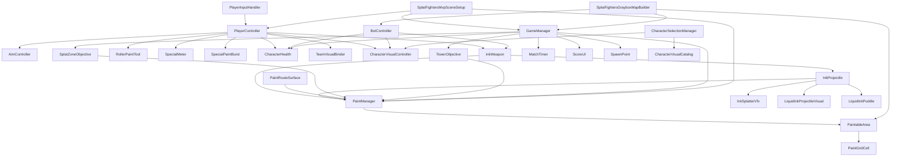

# Splat Fighters Midterm Deep Dive

This document is a technical reading of the current project state. It is written to show how the game works, where the assets live, how the scripts connect to each other, and how the scene is assembled.

## 1. Project Summary

Splat Fighters is a third-person territory-control shooter inspired by Splatoon. The core loop is:

1. Move through the arena.
2. Aim and fire ink projectiles or close-range paint.
3. Convert the floor into Team A or Team B territory.
4. Use painted ground to support movement, scoring, special mechanics, and objective control.
5. Win by coverage or by mode-specific objectives.

The current project is already beyond a basic prototype. It includes:

- a playable MVP scene
- a graybox arena builder
- imported hangar environment assets
- Team A / Team B readability work
- Team B bot AI
- painted territory tracking
- objective systems for Splat Zone and Tower Control
- character selection using imported monster assets
- performance profiles for different hardware targets

## 2. Architecture Overview

The important point is that gameplay is not hard-coded into the scene. The scene is largely a runtime composition of systems:

- the editor builders create or refresh the scene
- the manager layer controls match flow
- the paint layer tracks ownership
- the player and bot layers generate territory
- the UI layer reflects the current state

## 3. Script and Class Inventory

### 3.1 Editor / Scene Builders

#### `Assets/Editor/SplatFightersMvpSceneSetup.cs`
`SplatFightersMvpSceneSetup`

Creates the MVP shooting test scene from code. It builds lighting, camera, paint manager, game manager, paintable ground, player, projectile prefab, and HUD anchors.

Key methods:

- `CreateMvpShootingTestScene()`
- `CreateLighting()`
- `CreateCamera()`
- `CreatePaintManager()`
- `CreateGameManager(PaintManager paintManager)`
- `CreatePaintableGround(Material groundMaterial)`
- `CreatePlayer(Material shooterMaterial, InkProjectile projectilePrefab, Camera camera)`
- `ConfigureCharacterHealth(CharacterHealth health, Team team, Transform groundProbe)`
- `CreateSwimFormVisual(Transform parent, Material material)`
- `ConfigureCameraFollow(Camera camera, Transform target)`

#### `Assets/Editor/SplatFightersGrayboxMapBuilder.cs`
`SplatFightersGrayboxMapBuilder`

Builds the full graybox arena and overwrites the MVP scene layout with an imported hangar environment plus gameplay blockers, routes, objectives, spawns, and Team B bot setup.

Key methods:

- `BuildIntoMvpScene()`
- `BuildInCurrentScene()`
- `BuildBoundaryWalls(...)`
- `BuildContestObstacles(...)`
- `BuildSidePlatforms(...)`
- `BuildPaintRoutes(...)`
- `BuildHangarAssetVisuals(...)`
- `BuildSplatZoneObjective(...)`
- `BuildTowerObjective(...)`
- `BuildSpawnPoints(...)`
- `BuildTeamBBot(...)`
- `ConfigurePaintableGroundForGrayboxMap()`
- `PositionExistingPlayerAtTeamASpawn(...)`
- `PositionExistingCameraForGrayboxMap()`
- `ConfigureGameManagerForMatchFlow()`

#### `Assets/Editor/RpgMonsterCharacterCatalogBuilder.cs`
`RpgMonsterCharacterCatalogBuilder`

Builds `Assets/Resources/CharacterVisualCatalog.asset` from the imported RPG Monster pack so the runtime can swap character visuals without manual scene wiring.

### 3.2 Managers

#### `Assets/Scripts/Managers/GameManager.cs`
`GameManager`

Controls match state, match mode, scoring refresh, respawn/reset flow, pause/resume, and objective synchronization.

Public API:

- `StartMatch()`
- `EndMatch()`
- `ResetMatch()`
- `RestartMatch()`
- `PauseMatch()`
- `ResumeMatch()`
- `TogglePause()`
- `CycleMatchMode()`
- `GetCoveragePercent(Team team)`

Important state:

- `MatchState` = `WaitingToStart`, `Playing`, `Paused`, `Finished`
- `MatchMode` = `TurfWar`, `SplatZones`, `TowerControl`

#### `Assets/Scripts/Managers/MatchTimer.cs`
`MatchTimer`

Stores match duration and remaining time. `GameManager` reads it to drive the HUD and finish condition.

#### `Assets/Scripts/Managers/PerformanceProfile.cs`
`PerformanceProfile`

Applies hardware-facing runtime settings such as target frame rate, VSync, and fixed delta time.

### 3.3 Painting System

#### `Assets/Scripts/Painting/PaintManager.cs`
`PaintManager`

The central territory authority. It paints world positions, returns coverage percentages, scans ownership, and clears or rebuilds paint state.

Public API:

- `PaintAtWorldPosition(Vector3 worldPosition, float radius, Team team)`
- `GetCoveragePercent(Team team)`
- `GetCellCount(Team team)`
- `GetTotalCellCount()`
- `GetLeadingTeam()`
- `CanPaintAtWorldPosition(Vector3 worldPosition)`
- `TryGetTeamAtWorldPosition(Vector3 worldPosition, out Team team)`
- `TryFindNearestCellOwnedBy(Team owner, Vector3 origin, float maxDistance, out Vector3 worldPosition)`
- `GetTeamCellCountsInWorldBounds(Bounds bounds, out int totalPaintableCells, out int teamACells, out int teamBCells)`
- `RegisterArea(PaintableArea area)`
- `UnregisterArea(PaintableArea area)`
- `RefreshPaintableAreas()`
- `ClearAllPaint()`

#### `Assets/Scripts/Painting/PaintableArea.cs`
`PaintableArea`

Represents a paintable surface with a grid resolution and world-space bounds. The graybox map configures this for the arena floor.

#### `Assets/Scripts/Painting/PaintGridCell.cs`
`PaintGridCell`

The cell-level storage used by `PaintManager` and `PaintableArea` to track ownership.

#### `Assets/Scripts/Painting/Team.cs`
`Team`

The team enum used everywhere across gameplay, UI, visuals, and objectives.

### 3.4 Player

#### `Assets/Scripts/Player/PlayerInputHandler.cs`
`PlayerInputHandler`

Collects movement, jump, fire, and swim input.

#### `Assets/Scripts/Player/PlayerController.cs`
`PlayerController`

Moves the player character, handles paint-state movement checks, swimming state, and movement gating on painted routes.

Important public state:

- `IsOnOwnPaint`
- `IsOnEnemyPaint`
- `IsSwimming`
- `IsUsingPaintRoute`
- `WantsToSwim`
- `PlayerTeam`

#### `Assets/Scripts/Player/AimController.cs`
`AimController`

Computes aim direction and aim target from the player camera or viewport ray.

#### `Assets/Scripts/Player/ThirdPersonCameraFollow.cs`
`ThirdPersonCameraFollow`

Keeps the camera attached to the player with a third-person offset.

#### `Assets/Scripts/Player/SpecialMeter.cs`
`SpecialMeter`

Tracks special energy.

#### `Assets/Scripts/Player/SpecialPaintBurst.cs`
`SpecialPaintBurst`

Executes the special ink burst behavior when the meter is full.

### 3.5 Weapons and Combat

#### `Assets/Scripts/Weapons/InkWeapon.cs`
`InkWeapon`

The main shooter component. It handles:

- fire cooldown
- ink resource
- team-aware projectile spawning
- external aim direction and aim target
- paint-at-target behavior
- external fire blocking
- resource recovery

Public API:

- `TryFire()`
- `ResetInkResource()`
- `SetExternalRecoveryMultiplier(float multiplier)`
- `SetExternalFireBlocked(bool blocked)`
- `SetAimDirection(Vector3 worldDirection)`
- `SetAimTarget(Vector3 worldPoint, bool hasTarget)`
- `ClearAimDirection()`
- `RefreshIgnoredColliderCache()`

#### `Assets/Scripts/Weapons/InkProjectile.cs`
`InkProjectile`

Rigidbody projectile used by the weapon. It performs sweep hits, paints on impact, and can be configured with a target point and team ownership.

Public API:

- `Launch(Vector3 direction, float speed, float radius, Team ownerTeam)`
- `Launch(Vector3 direction, float speed, float radius, Team ownerTeam, Vector3 targetPoint, bool hasTargetPoint)`
- `Launch(Vector3 direction, float speed, float radius, Team ownerTeam, Vector3 targetPoint, bool hasTargetPoint, bool canPaint)`
- `IgnoreColliders(Collider[] collidersToIgnore)`

#### `Assets/Scripts/Weapons/RollerPaintTool.cs`
`RollerPaintTool`

Close-range paint tool used by the player loadout.

#### `Assets/Scripts/Weapons/PlayerToolSwitcher.cs`
`PlayerToolSwitcher`

Switches between weapon/tool modes.

#### `Assets/Scripts/Combat/CharacterHealth.cs`
`CharacterHealth`

Handles elimination, respawn gating, and health state.

### 3.6 AI

#### `Assets/Scripts/AI/BotController.cs`
`BotController`

Controls Team B enemy behavior. It patrols waypoints, looks for enemy paint targets, retreats when needed, and fires its weapon.

Public API:

- `BotTeam`
- `SetWaypoints(Transform[] newWaypoints)`
- `SetPaintTargets(Transform[] newPaintTargets)`
- `ResetBotState()`

### 3.7 Objectives and Level Rules

#### `Assets/Scripts/Level/SpawnPoint.cs`
`SpawnPoint`

Marker used for team spawning and respawn routing.

#### `Assets/Scripts/Level/PaintBlocker.cs`
`PaintBlocker`

Defines regions that should not become paintable.

#### `Assets/Scripts/Level/PaintRouteSurface.cs`
`PaintRouteSurface`

Conditional traversal surface. It checks local ownership via `PaintManager` and only supports the intended team.

#### `Assets/Scripts/Level/SplatZoneObjective.cs`
`SplatZoneObjective`

Reads paint ownership in a zone and determines contest/control state.

#### `Assets/Scripts/Level/TowerObjective.cs`
`TowerObjective`

Tracks route progress and team push state for the Tower Control mode.

### 3.8 UI

#### `Assets/Scripts/UI/ScoreUI.cs`
`ScoreUI`

Renders the runtime HUD, including:

- game title banner
- timer
- Team A / Team B coverage
- ink and health
- special meter
- zone / tower objective readouts
- state text
- control hints

Public API:

- `UpdateView(...)`

#### `Assets/Scripts/UI/AimReticleUI.cs`
`AimReticleUI`

Displays the aiming reticle.

### 3.9 Visuals and Presentation

#### `Assets/Scripts/Visuals/TeamVisualPalette.cs`
`TeamVisualPalette`

Central place for Team A and Team B colors, overlays, and shared visual constants. The runtime palette stores the selected player and opponent ink colors in `PlayerPrefs`, so paint feedback follows the chosen characters.

#### `Assets/Scripts/Visuals/TeamVisualBinder.cs`
`TeamVisualBinder`

Binds the current team color to renderers on a character or other object.

#### `Assets/Scripts/Visuals/InkSplatterVfx.cs`
`InkSplatterVfx`

Spawned visual burst for impact feedback.

#### `Assets/Scripts/Visuals/LiquidInkProjectileVisual.cs`
`LiquidInkProjectileVisual`

Adds a more polished projectile look, including glossy runtime material treatment and a short trail.

#### `Assets/Scripts/Visuals/LiquidInkPuddle.cs`
`LiquidInkPuddle`

Creates short-lived puddle decals or blob quads on impact.

#### `Assets/Scripts/Visuals/CharacterVisualCatalog.cs`
`CharacterVisualCatalog`

ScriptableObject catalog that exposes imported monster character visuals. It is loaded from `Resources` so runtime selection can work without hard scene references.

Important runtime behavior:

- loads the default catalog from `Resources/CharacterVisualCatalog`
- provides fallback options if the asset is missing
- stores prefabs, signature ink colors, animation state names, height targets, footprint targets, and local offsets

#### `Assets/Scripts/Visuals/CharacterSelectionManager.cs`
`CharacterSelectionManager`

Bootstraps character selection at runtime.

Important behavior:

- registers a scene-loaded callback and auto-creates itself when the gameplay scene loads
- attaches imported character visuals to Player and Bot
- lets the player cycle the selected character with `C` and `V`
- persists both selected character indexes and their signature ink colors in `PlayerPrefs`
- renders a runtime text HUD for the current character

#### `Assets/Scripts/Visuals/CharacterVisualController.cs`
`CharacterVisualController`

Replaces the primitive prototype character renderers with imported prefab visuals while keeping gameplay colliders intact.

Important behavior:

- instantiates the selected prefab under a dedicated pivot
- fits the imported model to the character controller height and footprint
- tints materials using each selected character's signature ink color
- swaps animation states such as idle, run, sense, and attack
- hides legacy prototype meshes and swim visual objects

## 4. Key Runtime Data Flow

### 4.1 Player fire and paint flow

1. `PlayerInputHandler` receives fire input.
2. `PlayerController` and `AimController` compute direction and target.
3. `InkWeapon` validates ink and cooldown.
4. `InkWeapon` launches `InkProjectile` or applies direct paint.
5. `InkProjectile` hits the world and paints through `PaintManager`.
6. `PaintManager` updates the owning `PaintGridCell`s inside `PaintableArea`.
7. `ScoreUI` and `GameManager` read the new ownership percentages.

### 4.2 Bot behavior flow

1. `BotController` patrols between assigned waypoints.
2. It evaluates nearby enemy paint and safety state.
3. It picks a target position or retreat direction.
4. It aims the weapon and calls `InkWeapon.TryFire()`.
5. It contributes to Team B coverage and objective pressure.

### 4.3 Objective flow

1. `SplatZoneObjective` and `TowerObjective` query paint ownership through `PaintManager.GetTeamCellCountsInWorldBounds(...)`.
2. Their visual state and control state change based on the current local paint distribution.
3. `GameManager` reads objective state to decide the match outcome in non-TurfWar modes.

### 4.4 Match flow

1. `GameManager.StartMatch()` enters active play.
2. During play, it refreshes score, objective state, and respawn state.
3. `PauseMatch()` and `ResumeMatch()` manage the paused state.
4. `EndMatch()` stops the match and shows the result state.
5. `ResetMatch()` clears paint and resets characters, objectives, and UI.

## 5. Scene Objects and Spatial Layout

### 5.1 Main scene

The active scene is:

- `Assets/Scenes/MVP_ShootingTest.unity`

The arena is generated around a single root:

- `LevelRoot`

Main groups under `LevelRoot`:

- `BoundaryWalls`
- `Obstacles`
- `Cover`
- `Platforms`
- `PaintRoutes`
- `Objectives`
- `SpawnPoints`
- `AI`
- `HangarAssetVisuals`

### 5.2 Major generated objects

The layout is centered on a 32 x 36 arena. The most important objects are placed with explicit world positions in the builder so the scene can be regenerated consistently.

#### Position reference for core gameplay anchors

| Object | Approximate World Position | Purpose |
| --- | --- | --- |
| `CenterContestBlock` | `(0, 0.55, 0)` | Main center cover and contest choke |
| `CenterSplatZone` | `(0, 0.035, 0)` | Splat Zone capture area |
| `TeamASpawn` | South side of the arena | Player team spawn |
| `TeamBSpawn` | North side of the arena | Enemy team spawn |
| `WestSidePlatform` | `(-10.8, 0.25, -1.25)` | Left-side elevated route |
| `EastSidePlatform` | `(10.8, 0.25, 1.25)` | Right-side elevated route |
| `NorthPerchPlatform` | `(4.8, 0.22, 12.1)` | High north-side perch |
| `SouthPerchPlatform` | `(-4.8, 0.22, -12.1)` | High south-side perch |
| `WestPaintRouteSurface` | `(-10.05, 1.05, -2.2)` | Team A route gate |
| `EastPaintRouteSurface` | `(10.05, 1.05, 2.2)` | Team B route gate |
| `CenterTowerObjective` | Around the origin on the center lane | Tower Control objective |
| `TeamBBot` | North / Team B side | Patrol and combat AI |

#### Boundary and map limits

- `NorthArenaContainmentWall`
- `SouthArenaContainmentWall`
- `EastArenaContainmentWall`
- `WestArenaContainmentWall`
- `NorthBoundaryRail`
- `SouthBoundaryRail`
- `EastBoundaryRail`
- `WestBoundaryRail`
- `NorthEastCornerPost`
- `NorthWestCornerPost`
- `SouthEastCornerPost`
- `SouthWestCornerPost`
- `NorthBackstop`
- `SouthBackstop`

The arena containment walls are invisible high `BoxCollider` objects that prevent players, bots, and projectiles from escaping the playable rectangle. The lower boundary rail and backstop objects remain as layout anchors and paint blockers, while the imported hangar wall meshes provide the visible wall treatment.

#### Center contest geometry

- `CenterContestBlock`
- `CenterLeftPillar`
- `CenterRightPillar`
- `NorthCenterScreen`
- `SouthCenterScreen`

These make the center of the map readable and create layered cover around the main contest lane.

#### Side and spawn-side cover

- `LeftMidCover`
- `RightMidCover`
- `LeftCenterCutCover`
- `RightCenterCutCover`
- `TeamAForwardCover`
- `TeamBForwardCover`
- `TeamAMidLeftCover`
- `TeamBMidRightCover`
- `TeamASpawnLeftCover`
- `TeamASpawnRightCover`
- `TeamBSpawnLeftCover`
- `TeamBSpawnRightCover`
- `LeftLaneLowBlock`
- `RightLaneLowBlock`
- `LeftLaneBackCover`
- `RightLaneBackCover`

These objects are the map’s tactical micro-cover and lane structure.

#### Platforms and ramps

- `WestSidePlatform`
- `EastSidePlatform`
- `WestFlankPlatform`
- `EastFlankPlatform`
- `NorthPerchPlatform`
- `SouthPerchPlatform`
- `WestPlatformRamp`
- `EastPlatformRamp`
- `NorthPerchRamp`
- `SouthPerchRamp`

These provide vertical variation and movement routes without turning the map into a complex platformer.

#### Paint route surfaces

- `WestPaintRouteUpperDeck`
- `WestPaintRouteProbe`
- `WestPaintRouteSurface`
- `EastPaintRouteUpperDeck`
- `EastPaintRouteProbe`
- `EastPaintRouteSurface`

These are special traversal areas that depend on paint ownership.

#### Objectives

- `CenterSplatZone`
- `CenterTowerRoute`
- `CenterTower_TeamBGoal`
- `CenterTower_CenterPoint`
- `CenterTower_TeamAGoal`
- `CenterTowerObjective`
- `CenterTowerPlatform`
- `CenterTowerMast`

#### Spawns

- `TeamASpawn`
- `TeamBSpawn`

#### AI

- `TeamBBot`
- `TeamBBotFirePoint`
- `TeamBBotPatrolPoints`
- `TeamBBotPaintTargets`
- `TeamBBotPatrol_01` through `TeamBBotPatrol_06`
- `TeamBBotPaintTarget_*`

### 5.3 Hangar environment dressing

The graybox arena is no longer only colored cubes. It is dressed with imported hangar assets under `HangarAssetVisuals`.

Typical objects built there include:

- `HangarMainFloor`
- `HangarPaintableFloorSurface`
- `HangarNorthWall`
- `HangarSouthWall`
- `HangarEastWall`
- `HangarWestWall`
- roof and ceiling trims
- lights and lamp fixtures
- scaffolds
- crates and pallets
- generator, toolbox, trolley props

The gameplay geometry remains simple and explicit, but the visible environment is now a proper industrial hangar scene.

## 6. Asset Inventory

### 6.1 Core project assets

#### Scene and prefab assets

- `Assets/Scenes/MVP_ShootingTest.unity`
- `Assets/Prefabs/Weapons/InkProjectile.prefab`

#### Materials

Team and test materials:

- `Assets/Materials/MAT_TestShooter_Debug.mat`
- `Assets/Materials/MAT_Ground_Debug.mat`
- `Assets/Materials/MAT_InkProjectile_TeamA.mat`

Team materials:

- `Assets/Materials/Teams/MAT_TeamA_Player.mat`
- `Assets/Materials/Teams/MAT_TeamA_Projectile.mat`
- `Assets/Materials/Teams/MAT_TeamB_Projectile.mat`
- `Assets/Materials/Teams/MAT_TeamB_Bot.mat`

Level materials:

- `Assets/Materials/Level/MAT_Level_Boundary.mat`
- `Assets/Materials/Level/MAT_Level_Cover.mat`
- `Assets/Materials/Level/MAT_Level_Platform.mat`
- `Assets/Materials/Level/MAT_Level_Ramp.mat`
- `Assets/Materials/Level/MAT_Level_PaintRoute.mat`
- `Assets/Materials/Level/MAT_Level_SplatZone.mat`
- `Assets/Materials/Level/MAT_Level_TowerObjective.mat`
- `Assets/Materials/Level/MAT_Level_Spawn_TeamA.mat`
- `Assets/Materials/Level/MAT_Level_Spawn_TeamB.mat`

#### Shaders

- `Assets/Shaders/InkLiquidOverlay.shader`
- `Assets/Shaders/LiquidInkBlob.shader`

#### Render pipeline settings

- `Assets/Settings/URP-Performant.asset`
- `Assets/Settings/URP-Performant-Renderer.asset`
- `Assets/Settings/URP-Balanced.asset`
- `Assets/Settings/URP-Balanced-Renderer.asset`
- `Assets/Settings/URP-HighFidelity.asset`
- `Assets/Settings/URP-HighFidelity-Renderer.asset`

These are important for adapting the game to slower hardware such as a MacBook Air.

### 6.2 Imported hangar pack

Folder:

- `Assets/Hangar Building Modular/`

Purpose:

- provides the visible hangar environment for the arena
- replaces the all-gray or all-cube look
- keeps the gameplay collisions simple while making the scene look like a real place

Main file groups:

- meshes: floor, wall, roof, frame, lamp, generator, toolbox, trolley, box, pallet, scaffold
- prefabs: floor, wall, roof, frame, lamp, generator, toolbox, trolley, box, pallet, scaffold
- materials: floor, wall, roof, roof frame, wall frame, metal wall, box, pallet, generator, toolbox, trolley, lamp, scaffold, gate, glass
- textures: floor, wall, roof, roof frame, wall frame, metal wall, box, pallet, generator, toolbox, trolley frame, scaffold, scaffold small, lamp, gate, window, roof windows
- light flares: `small_lights_flare`, `big_lights_flare`

### 6.3 Imported RPG monster pack

Folder:

- `Assets/RPG Monster Wave PBR/`

Purpose:

- supplies imported 3D character visuals for selection and team readability
- provides a richer non-prototype look for the player and bot

Main categories:

- `Meshes/` for character base meshes and stage mesh
- `Materials/` and `Shaders/` for PBR and tint support
- `Animations/` for idle, run, walk, attack, hit, victory, death, sense, taunt, and dizzy states
- `Animators/` for the corresponding controller assets
- `Prefabs/` and `Scenes/` for source pack content

The character types currently used in the project are:

- Bat
- Dragon
- EvilMage
- Golem
- MonsterPlant
- Orc
- Skeleton
- Slime
- Spider
- TurtleShell

### 6.4 Runtime character prefab resources

Folder:

- `Assets/Resources/CharacterPrefabs/`

These are the runtime-ready prefabs referenced by `CharacterVisualCatalog`:

- `BatPBRMaskTint.prefab`
- `DragonPBRMaskTint.prefab`
- `EvilMagePBRMaskTint.prefab`
- `GolemPBRMaskTint.prefab`
- `MonsterPlantPBRMaskTint.prefab`
- `OrcPBRMaskTint.prefab`
- `SkeletonPBRMaskTint.prefab`
- `SlimePBRMaskTint.prefab`
- `SpiderPBRMaskTint.prefab`
- `TurtleShellPBRMaskTint.prefab`

### 6.5 Character catalog asset

- `Assets/Resources/CharacterVisualCatalog.asset`

This is the runtime catalog that maps character display names to prefabs and animation metadata.

## 7. How the Imported Assets Are Used

### Hangar pack

The hangar pack is used as visible environment dressing only. The arena still uses explicit gameplay geometry, blockers, and objective volumes created by the editor builder. This is the right choice for a class project because it preserves stable playability while improving presentation.

### RPG monster pack

The monster pack is used through a selection catalog and a visual controller. The gameplay body stays the same, but the rendered character changes. That means:

- the controller and collider logic stay stable
- the look can vary without rewriting gameplay
- Team A and Team B can remain readable through tinting

### URP profiles

The three URP profiles are a practical performance tool:

- `Performant` for weaker machines
- `Balanced` for normal development
- `HighFidelity` for higher-end machines

This matters because the project already has performance pressure from 3D scene content, runtime VFX, and imported meshes.

## 8. Current Implementation Strengths

The strongest signs that the project is understood and under control are:

- the scene can be regenerated from code
- the map is not only decorative, it is gameplay-aware
- paint ownership is a shared system, not isolated per object
- objectives read from the same paint grid as the scoring system
- player and bot are both team-aware
- imported assets are integrated through runtime catalogs instead of one-off manual scene edits
- the UI reads from the match state instead of hard-coded values
- performance profiles exist for different hardware tiers

## 9. Known Risks and Constraints

- Imported art can raise frame cost if too many high-poly props, materials, or effects are active at once.
- The project still has placeholder or cleanup items, such as `Assets/Scenes/NewBehaviourScript.cs`.
- Any future scene regeneration must preserve the gameplay anchors and not wipe required objects.
- New features should keep the single `Tianbo-Cao` branch workflow and English repository-facing text.
- Audio, menu flow, and additional modes are still planned and should be added in small increments.

## 10. Why This Document Demonstrates Project Understanding

This document is not just a feature list. It shows:

- where each gameplay system lives
- how the systems depend on each other
- which assets are presentation-only versus gameplay-critical
- how the map is generated and why the builder matters
- how the team model is represented across logic, UI, visuals, and AI
- how paint ownership becomes the shared source of truth for scoring and objectives
- how imported third-party assets are organized into a runtime-ready workflow
- how the project is being shaped toward a complete Splatoon-like experience rather than a toy prototype

## 11. Suggested Midterm Talking Points

If you need to present the project to your instructor, the clearest explanation is:

1. This is a team-based territory shooter.
2. The player wins by painting the arena and controlling objectives.
3. The scene is generated and maintained by editor automation.
4. The core systems are modular: movement, weapon, paint, AI, objectives, UI, and visuals are separated.
5. Imported third-party assets are used to improve presentation without breaking the gameplay rules.
6. The project is already playable and is being expanded toward menu flow, more maps, character selection, audio, and practice modes.
